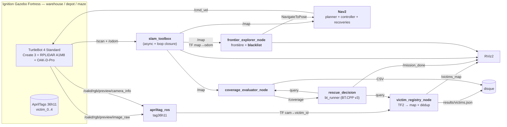

# Autonomous Search and Rescue — Projet B (IA712)

> Robot mobile autonome qui explore une zone sinistrée simulée sous Ignition Gazebo, cartographie l'environnement (SLAM avec loop closure) et localise des « victimes » (AprilTags) **sans intervention humaine**.

[](https://docs.ros.org/en/humble/)
[](https://releases.ubuntu.com/22.04/)
[](LICENSE)

[English version](README.md)

---

## Sommaire

1. [Équipe](#équipe-ensta--télécom-paris--ia712)
2. [Énoncé synthétique](#énoncé-synthétique)
3. [Architecture système](#architecture-système)
4. [Pistes par brique](#pistes-par-brique)
5. [Arborescence du dépôt](#arborescence-du-dépôt)
6. [Prérequis & installation](#prérequis--installation)
7. [Build & lancement](#build--lancement)
8. [État d'avancement](#état-davancement-phasage-6-séances)
9. [Risques & mitigations](#risques--mitigations)
10. [Stratégie bonus](#stratégie-bonus)
11. [Critères de réussite](#critères-de-réussite-auto-check-avant-l18)
12. [Références](#références)

---

## Équipe (ENSTA / Télécom Paris — IA712)

| Nom            | Email                              | Rôle          |
| -------------- | ---------------------------------- | ------------- |
| Julien GIMENEZ | julien.gimenez@telecom-paris.fr    | _à définir_   |
| Hugo FANCHINI  | hugo.fanchini@telecom-paris.fr     | _à définir_   |
| Paul CINTRA    | paul.cintra@telecom-paris.fr       | _à définir_   |
| Yimou ZHANG    | yimou.zhang@telecom-paris.fr       | _à définir_   |

---

## Énoncé synthétique

**Module :** IA712 — Mobile Robotics (Pr. Zhi Yan, ENSTA - Institut Polytechnique de Paris)
**Sujet B :** *Autonomous Search and Rescue*.

> *« Dans une zone de catastrophe simulée, un robot doit explorer automatiquement un environnement inconnu, localiser des « victimes » (représentées par des AprilTags ou des cylindres colorés spécifiques) et reporter leurs coordonnées précises. »* — énoncé officiel

### Objectifs (extraits de l'énoncé + cours)

1. **Exploration autonome** sans téléopération — frontière (baseline attendue) ou RRT.
2. **SLAM** avec loop closure (`slam_toolbox`) — couverture cible **≥ 90 %**.
3. **Détection des « victimes »** via **AprilTags** (ou ArUco / QR / blobs colorés) — *« vous ne ferez donc pas la détection humaine sophistiquée YOLO »* (Pr. Yan).
4. **Projection TF** : *« projeter leurs positions depuis le repère caméra vers le repère global via TF2 »*.
5. **Behavior Tree** obligatoire (interdiction des FSM, contrainte commune aux 4 sujets).
6. **One-click launch** : un seul bringup lance tout.
7. **Bonus** : comparaison quantitative *frontier-greedy* vs *information-gain*.

### Contraintes communes (énoncé)

| Contrainte         | Valeur                                                      |
| ------------------ | ----------------------------------------------------------- |
| Logiciels          | ROS 2 + Gazebo                                              |
| Décision           | Behavior Trees (interdiction FSM)                           |
| One-click          | un seul bringup lance tout                                  |
| Versionnement      | GitHub                                                      |
| Démo finale        | session L18 — 10 min présentation + 10 min Q&A              |
| Rapport            | ≤ 10 pages PDF — équipe, archi (schéma détaillé), lessons learned |
| Deadline rapport   | **21 juin**                                                 |

---

## Architecture système

Le projet est découpé en **quatre paquets ROS 2** : `rescue_bringup` (launch + configs), `rescue_robot` (le « mégapaquet » Python : exploration, perception, résultats, mocks), `rescue_world` (mondes Ignition + cibles AprilTag) et `rescue_decision` (le superviseur BehaviorTree.CPP).



### Flux clés

1. **SLAM en continu** publie `/map` et la TF `map → odom`.
2. **`frontier_explorer_node`** lit `/map`, choisit la meilleure frontière et l'envoie à Nav2 via `nav2_msgs/action/NavigateToPose`. Les frontières inatteignables sont **blacklistées** (voir ci-dessous) pour que le robot ne tourne jamais en boucle sur une frontière morte.
3. **`apriltag_ros`** publie une TF `caméra → victim_<id>` pour chaque tag visible.
4. **`victim_registry_node`** projette chaque détection du repère caméra vers `map` via TF2, déduplique par ID de tag, et persiste `results/victims.json`.
5. **`coverage_evaluator_node`** publie `/coverage` à partir de la grille d'occupation.
6. **`bt_runner`** (BehaviorTree.CPP v3) supervise la mission : il attend `/map`, vérifie `/coverage ≥ 0.90`, expose le nombre de victimes en temps réel et verrouille `/mission_done`.
7. **Critère d'arrêt :** couverture ≥ 90 % (en run, ~90 % de couverture atteint) **OU** plus de frontière atteignable.

---

## Pistes par brique

Chaque brique correspond à un paquet ROS 2 (cf. [§ Arborescence](#arborescence-du-dépôt)).

### [`rescue_world`](ros2_ws/src/rescue_world/) — Mondes Ignition + cibles AprilTag

- **Mondes :** on utilise les mondes Ignition Fortress livrés par `turtlebot4_ignition_bringup` (`warehouse`, `depot`, `maze`) ; un `rescue_arena.sdf` custom et un `disaster_world.world` legacy sont aussi fournis.
- **AprilTags :** famille **tag36h11**, IDs 0-4, côté de **16 cm**, posés sur murs à hauteur caméra OAK-D.
- **Fallback legacy :** mondes TurtleBot 3 Waffle Pi sous Gazebo Classic 11, conservés pour les hôtes où le rendu Ignition est instable.

### [`rescue_robot`](ros2_ws/src/rescue_robot/) — Exploration, perception, résultats (mégapaquet Python)

Ce paquet Python unique héberge les nodes d'autonomie, groupés par sous-module (`exploration/`, `detection/`, `results/`, `bt/`, `mocks/`).

#### Exploration autonome avec blacklist de frontières (fonctionnalité distinctive)

- **`frontier_explorer_node`** + **`frontier_search.py`** — détection des frontières (cellules `free` adjacentes à `unknown`, CM8), clustering BFS 8-connectivité, et un action client `NavigateToPose` (Yamauchi 1997, CM8 §6-14). L'exploration autonome est **validée en run (~90 % de couverture atteint)**.
- **Blacklist des frontières inatteignables (CM8 « Inaccessible Frontiers ») :** une frontière dont Nav2 abandonne la navigation (status `ABORTED`), ou qui est re-sélectionnée sans progrès de couverture, est **blacklistée et plus jamais re-sélectionnée**. La clé de la blacklist est une **coordonnée monde quantifiée**, donc stable quand la carte grandit. C'est ce qui empêche le robot de tourner en boucle infinie sur une frontière morte. Paramètres dans [`config/explorer_params.yaml`](ros2_ws/src/rescue_robot/config/explorer_params.yaml) :
  - `blacklist_quantum_m` — taille du bucket (en mètres monde) servant de clé pour les frontières blacklistées.
  - `stall_repeats` — une frontière re-sélectionnée à couverture stable pendant ce nombre de ticks est blacklistée.
  - `coverage_epsilon` — delta minimal de couverture compté comme un progrès.
  - `max_blacklist_clears` — nombre de fois où toute la blacklist peut être vidée (une frontière peut redevenir atteignable plus tard).

#### Registre des victimes (AprilTag → map)

- **Détecteur :** [`apriltag_ros`](https://github.com/christianrauch/apriltag_ros) (apt), **tag36h11**, sur le flux OAK-D `/oakd/rgb/preview/image_raw`. Config tags : [`apriltag_tags.yaml`](ros2_ws/src/rescue_bringup/config/apriltag_tags.yaml) (IDs 0-4 → frames `victim_0..4`, taille 0.16 m). Pas de calibration manuelle : l'OAK-D simulée publie ses intrinsics dans `/oakd/rgb/preview/camera_info`.
- **`victim_registry_node`** (Python) : pour chaque détection, lookup `caméra → victim_<id> → map` via TF2, **déduplication par ID de tag**, publication de markers `/victims_map` pour RViz, et **persistance `results/victims.json`** après chaque nouvel enregistrement.

#### Métriques de couverture

- **`coverage_evaluator_node`** s'abonne à `/map`, calcule `coverage = (free + occupied) / (free + occupied + unknown)`, et publie `/coverage` (le signal d'arrêt du BT) plus un CSV pour le benchmark bonus.

#### Mocks (dev sans Gazebo)

- `mock_map_publisher`, `mock_coverage_publisher`, `mock_victim_publisher` permettent à chacun de tester le BT, le registre et RViz **sans lancer Ignition / Nav2 / SLAM** (`mock_system.launch.py`).

### [SLAM via `slam_toolbox`](https://github.com/SteveMacenski/slam_toolbox) (intégré au bringup)

- **Mode :** `online_async` (intégration Nav2), lancé via `turtlebot4_navigation/slam.launch.py`.
- **Sortie :** `/map` (OccupancyGrid) + TF `map → odom`.
- **Tuning loop closure** ([`slam_params_tb4.yaml`](ros2_ws/src/rescue_robot/config/slam_params_tb4.yaml)) : `loop_match_minimum_chain_size: 10`, `scan_buffer_size: 10`, seuils de déplacement conservateurs.

### [`rescue_decision`](ros2_ws/src/rescue_decision/) — Behavior Tree global (BehaviorTree.CPP v3)

- **Moteur :** un **vrai** runner `BehaviorTree.CPP v3` ([`src/bt_runner.cpp`](ros2_ws/src/rescue_decision/src/bt_runner.cpp)), visualisable dans **Groot** (Monitor ZMQ sur **port 1666**), XML de l'arbre dans [`bt_xml/mission.xml`](ros2_ws/src/rescue_decision/bt_xml/mission.xml). Validé avec mocks.
- **Forme de l'arbre :** une `ReactiveSequence` tickée une fois par cycle du runner (le runner fait tourner l'exécuteur ROS entre les ticks pour que `/map` et `/coverage` restent à jour) :

```xml
<root main_tree_to_execute="Mission">
  <BehaviorTree ID="Mission">
    <ReactiveSequence name="search_and_rescue_mission">
      <WaitForMap name="wait_for_slam_map"/>
      <CoverageReached name="coverage_90" threshold="0.90"/>
      <VictimsFound name="report_victims" min_count="0"/>
      <PublishMissionDone name="finalize"/>
    </ReactiveSequence>
  </BehaviorTree>
</root>
```

- **Nodes BT custom :** `WaitForMap`, `CoverageReached` (lit `/coverage`), `VictimsFound` (expose le nombre de victimes en direct), `PublishMissionDone` (verrouille `/mission_done`).

### [`rescue_bringup`](ros2_ws/src/rescue_bringup/) — Launch & configs

- **Bringup principal (TB4 / Ignition Fortress) :** [`bringup_tb4.launch.py`](ros2_ws/src/rescue_bringup/launch/bringup_tb4.launch.py) lance une **seule** instance Ignition + Create 3 + RPLIDAR + OAK-D + SLAM + Nav2 + `apriltag_ros` (sur le flux OAK-D) + RViz (`project_view.rviz`, Frame Rate clampé à 10 pour la perf).
- **Fallback legacy :** `bringup.launch.py` lance la stack TurtleBot 3 Waffle Pi + Gazebo Classic 11.
- **Démo end-to-end validée :** `./scripts/run.sh demo-tb4` enchaîne toute la stack et, à l'étape 7b, la perception (`victim_registry`) et la supervision Behavior Tree (`bt_runner`).
- **Toggles d'isolation** (`headless`, `world`, `model`, `launch_rviz`) et variables d'environnement permettent d'activer/désactiver chaque brique sans relancer le simulateur.

---

## Arborescence du dépôt

```
autonomous-search-and-rescue/
├── README.md / README.fr.md       # ce document
├── LICENSE
├── pyproject.toml / .python-version  # env de dev uv (Python 3.10)
├── docs/                          # documentation projet
├── scripts/                       # scripts d'orchestration
│   ├── run.sh                     # point d'entrée : ./scripts/run.sh <commande>
│   ├── sh/                        # un petit exécutable par module
│   ├── generate_rescue_arena.py   # générateur de monde
│   └── plot_coverage.py           # plots de benchmark
├── tests/                         # 9 fichiers pytest (pilotés par uv)
└── ros2_ws/                       # workspace colcon
    └── src/
        ├── rescue_bringup/        # launch bringup_tb4 / bringup + configs Nav2/SLAM/AprilTag + rviz
        ├── rescue_robot/          # exploration (frontière + blacklist), perception, résultats, mocks (Python)
        │   └── rescue_robot/      # exploration/ detection/ results/ bt/ mocks/ utils/
        ├── rescue_world/          # mondes Ignition + modèles AprilTag
        └── rescue_decision/       # bt_runner.cpp + mission.xml (BehaviorTree.CPP v3)
```

Convention de nommage : préfixe **`rescue_*`** pour isoler nos paquets des dépendances vendor.

---

## Prérequis & installation

### Système

- **Ubuntu 22.04** (Jammy) — natif ou WSL 2.
- **ROS 2 Humble** installé (`source /opt/ros/humble/setup.bash`).
- **Python 3.10** (épinglé via `.python-version`), aligné sur Ubuntu 22.04 / ROS 2 Humble.

> **Si vous utilisez Conda** : désactiver l'environnement (`conda deactivate`) avant `colcon build`, sinon `rosidl` / `ament_cmake` utilisera le Python de Conda et le build casse.

### Paquets ROS (TurtleBot 4 + Ignition Gazebo Fortress)

```bash
sudo apt update && sudo apt install -y \
  ros-humble-turtlebot4-simulator \
  ros-humble-turtlebot4-ignition-bringup \
  ros-humble-turtlebot4-navigation \
  ros-humble-turtlebot4-msgs \
  ros-humble-irobot-create-msgs \
  ros-humble-ros-gz-bridge \
  ros-humble-nav2-bringup \
  ros-humble-nav2-behavior-tree \
  ros-humble-slam-toolbox \
  ros-humble-apriltag-ros \
  ros-humble-rviz2 \
  ros-humble-tf2-tools \
  ros-humble-behaviortree-cpp-v3 \
  ignition-fortress \
  python3-colcon-common-extensions
```

> Un installeur pratique est aussi fourni : `./scripts/run.sh install-apt`.

### Stack robot / simulation

- **Principal (par défaut) :** **TurtleBot 4 Standard** (Create 3 + RPLIDAR A1M8 + OAK-D-Pro) sous **Ignition Gazebo Fortress** (mondes `warehouse`, `depot`, `maze`).
- **Fallback (legacy, conservé) :** **TurtleBot 3 Waffle Pi** + **Gazebo Classic 11**, utile où le rendu Ignition est instable.

### Environnement de dev Python (uv)

Le runtime ROS 2 est gardé séparé du venv de dev Python. Utiliser `uv` pour les tests légers, les scripts de résultats et le lint :

```bash
./scripts/run.sh uv-sync
./scripts/run.sh uv-test
./scripts/run.sh uv-lint
```

Ne **pas** installer de paquets ROS 2 comme `rclpy` via uv/pip — ils viennent de l'installation ROS 2 Humble.

---

## Build & lancement

### Build

```bash
source /opt/ros/humble/setup.bash   # désactiver conda d'abord si vous l'utilisez
./scripts/run.sh build
```

### Lancement (stack TurtleBot 4 / Ignition Fortress)

```bash
# Démo end-to-end validée : stack TB4 complète + exploration + perception + BT
./scripts/run.sh demo-tb4

# OU le bringup TB4 simple (sim + SLAM + Nav2 + AprilTag + RViz), à piloter soi-même
ros2 launch rescue_bringup bringup_tb4.launch.py

# OU le fallback legacy TB3 / Gazebo Classic
ros2 launch rescue_bringup bringup.launch.py
```

Arguments du `bringup_tb4.launch.py` :

| Argument       | Valeurs                           | Description                                                |
| -------------- | --------------------------------- | ---------------------------------------------------------- |
| `use_sim_time` | `true` \| `false`                 | Utiliser le `/clock` d'Ignition pour tous les nodes        |
| `headless`     | `true` \| `false`                 | Lancer Ignition sans GUI (CI / benchmark)                  |
| `world`        | `warehouse` \| `depot` \| `maze`  | Monde Ignition (par défaut `warehouse`)                    |
| `model`        | `standard` \| `lite`              | Variante TurtleBot 4 (`standard` = avec OAK-D)             |
| `launch_rviz`  | `true` \| `false`                 | Lancer RViz2 avec `project_view.rviz` (Frame Rate=10)      |

### Variables d'environnement de la démo (`./scripts/run.sh demo-tb4`)

| Variable                | Défaut | Effet                                                        |
| ----------------------- | :----: | ------------------------------------------------------------ |
| `IA712_EXPLORE`         | `0`    | `1` = le robot explore tout seul (`frontier_explorer_node`)  |
| `IA712_BT`              | `1`    | `0` = désactive le superviseur Behavior Tree (`bt_runner`)   |
| `IA712_VICTIM_REGISTRY` | `1`    | `0` = désactive le registre de victimes                      |
| `IA712_TB4_GUI`         | `1`    | `0` = Ignition headless (pas de fenêtre Gazebo, CI / RAM limitée) |
| `IA712_RVIZ`            | `1`    | `0` = run entièrement headless (pas de RViz)                 |

### Autres commandes de l'orchestrateur

```bash
./scripts/run.sh mock        # mock map/coverage/victims — tester le BT + RViz sans Gazebo
./scripts/run.sh kill-sim    # nettoie tous les processus sim / Nav2 / nodes
./scripts/run.sh check-tb4   # sanity-check de la stack TB4
```

### Convention run/

Éditer les sources dans ce dossier ; builder et exécuter depuis une copie synchronisée sous `run/` (sync via `rsyncUp_run_bl.sh` depuis la racine du dépôt). Penser à `conda deactivate` avant `colcon build`.

---

## État d'avancement (phasage 6 séances)

| Séance | Statut | Livrable de fin de séance                                                                               |
| ------ | :----: | ------------------------------------------------------------------------------------------------------- |
| L13    |  Done  | Équipe formée, Projet B sélectionné, repo créé                                                           |
| L14    |  Done  | Architecture définie, paquets `rescue_*` scaffoldés, `colcon build` OK                                   |
| L15    |  Done  | SLAM (`slam_toolbox`) + exploration frontière autonome (`frontier_explorer_node` + `frontier_search.py`, avec **blacklist de frontières inatteignables** — CM8) + Nav2 + config AprilTag intégrés ; **exploration autonome validée en run (~90 % de couverture atteint)** |
| L16    |  Done  | **BT** : `rescue_decision/bt_runner.cpp` = vrai BehaviorTree.CPP v3 (ReactiveSequence dans `bt_xml/mission.xml`, Groot Monitor sur ZMQ port 1666), validé avec mocks. **Perception** : `victim_registry_node` projette les détections AprilTag vers `map` via TF2 (dédup par id, persistance `results/victims.json`) ; **5 modèles AprilTag tag36h11 générés** (`victim_0..4`, via `scripts/generate_apriltag_models.py`) + spawn dans le monde, `apriltag_ros` + bridge `camera_info` câblés. **Nav2 recovery réactivée** (spin/backup → un robot coincé se dégage). Tout intégré dans `run_demo_tb4.sh` (étapes 7b/8). _Run end-to-end victimes à finaliser sur une passe Gazebo (placement des tags + frames caméra à ajuster visuellement)._ |
| L17    |  TODO  | Bonus : comparatif frontier-greedy vs information-gain, benchmarks lancés, plots prêts                   |
| L18    |  TODO  | Démo live (10 min) + rapport rendu (≤ 10 pages, PDF)                                                     |

Cette branche est la plus avancée de l'équipe : **L16 Done**.

---

## Risques & mitigations

| Risque                                            | Probabilité | Impact   | Mitigation                                                          |
| ------------------------------------------------- | :---------: | :------: | ------------------------------------------------------------------- |
| Robot en boucle infinie sur une frontière inatteignable | Moyenne | Élevé   | **Blacklist de frontières** (clé quantifiée, détection `ABORTED`/stall) — implémenté |
| Loop closure mal tunée, carte dérive sur runs longs | Moyenne   | Élevé    | Tuning précoce de `slam_params_tb4.yaml` + serialized graph pour debug |
| AprilTag mal détecté (éclairage Ignition)         | Faible      | Moyen    | tag36h11 16 cm à hauteur caméra ; fallback cylindres colorés + HSV  |
| BT trop complexe, debug long                      | Moyenne     | Moyen    | `ReactiveSequence` minimale, Groot Monitor pour debug, tests pilotés par mocks |
| WSL2 / ARM64 + Gazebo GUI instable                | Moyenne     | Moyen    | `IA712_TB4_GUI=0` headless validé + profils plateforme auto + fallback TB3 legacy |
| Conda interfère avec `colcon` (déjà vu sur ce poste) | Élevée   | Faible   | `conda deactivate` avant build ; documenté ici                     |
| Membre absent, charge inégale                     | —           | —        | Propriété par module + mocks permettent à chacun de travailler indépendamment |

---

## Stratégie bonus

**Hypothèse à tester :** *l'exploration par information-gain réduit le temps pour atteindre 90 % de couverture de > 15 % par rapport à la frontière gloutonne, au prix d'une distance parcourue plus élevée.*

**Plan d'expérience :**
- 2 algorithmes × 3 runs × 1 monde = **6 runs**.
- Seed fixée ; position initiale identique.
- Métriques (CSV, via `coverage_evaluator_node`) : `time_to_50% / 75% / 90% / max coverage`, `total path length`, `# victims discovered`, `# loop closures`.
- Sortie rapport : 2 plots (coverage(t), bar-chart résumé, via `scripts/plot_coverage.py`) + tableau récap.

**Pourquoi c'est accessible :** l'info-gain ne réutilise que les frontières déjà détectées par `frontier_search.py` + un appel au service Nav2 `compute_path_to_pose`. Pas de nouvel algorithme global.

---

## Critères de réussite (auto-check avant L18)

- [ ] `./scripts/run.sh demo-tb4` lance tout en une commande, sans crash, sur machine fraîche.
- [ ] Couverture ≥ 90 % du monde de référence en run nominal (~90 % atteint à ce jour).
- [ ] Toutes les victimes (≥ 3) détectées, projetées vers `map`, et publiées comme markers RViz (±10 cm).
- [ ] Loop closure visible dans `slam_toolbox` sur au moins un run.
- [ ] BT visualisable dans Groot (ZMQ port 1666), XML versionné dans [`ros2_ws/src/rescue_decision/bt_xml/`](ros2_ws/src/rescue_decision/bt_xml/).
- [ ] Plots du bonus présents (frontier-greedy vs information-gain).
- [ ] Rapport ≤ 10 pages (sections : team / archi / lessons learned / résultats / bonus).
- [ ] Vidéo de backup de la démo enregistrée.
- [ ] Slides présentation prêtes (~6-8 slides pour 10 min).

---

## Références

### Cours IA712 (Pr. Zhi Yan)

| Lecture | Sujet directement réutilisé pour le projet                       |
| ------- | ---------------------------------------------------------------- |
| CM6     | Perception (capteurs caméra, détection)                          |
| CM7     | SLAM (Occupancy Grid, loop closure)                              |
| **CM8** | **Exploration (Frontier-based + Information-Gain, Inaccessible Frontiers) — central** |
| CM9     | Planning                                                         |
| CM10    | Navigation (Nav2, costmaps)                                      |

### Paquets externes

- [`apriltag_ros`](https://github.com/christianrauch/apriltag_ros) — détecteur AprilTag pour ROS 2 (apt)
- [`slam_toolbox`](https://github.com/SteveMacenski/slam_toolbox) — SLAM 2D avec loop closure
- [Nav2 docs](https://docs.nav2.org/) — stack de navigation
- [BehaviorTree.CPP](https://www.behaviortree.dev/) — moteur BT
- [Groot](https://www.behaviortree.dev/groot/) — éditeur / moniteur visuel BT

### Littérature

- Yamauchi, B. (1997). *A frontier-based approach for autonomous exploration*. CIRA.
- Stachniss, C., Grisetti, G., Burgard, W. (2005). *Information Gain-based Exploration Using Rao-Blackwellized Particle Filters*. RSS.

### Licence

MIT — voir [LICENSE](LICENSE).
