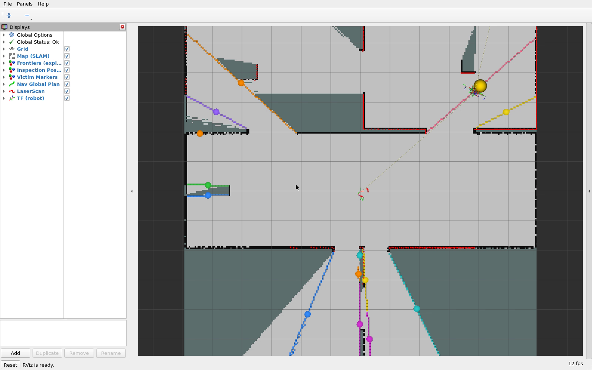
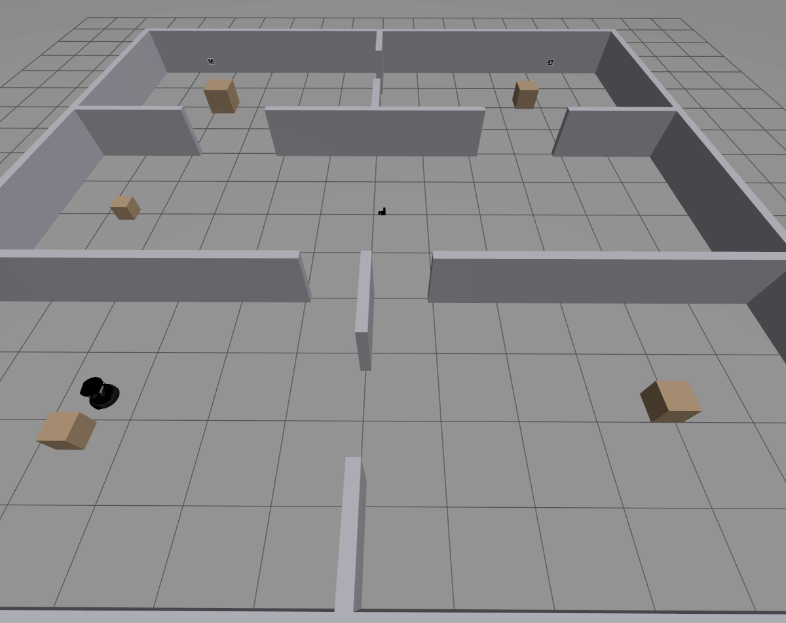
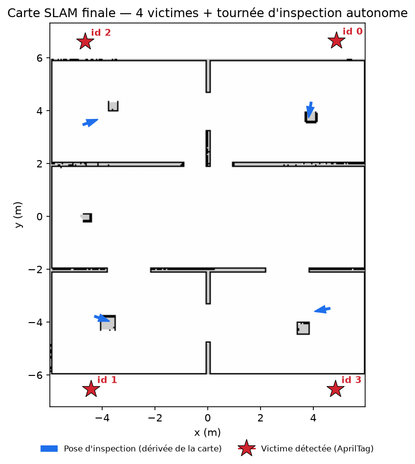
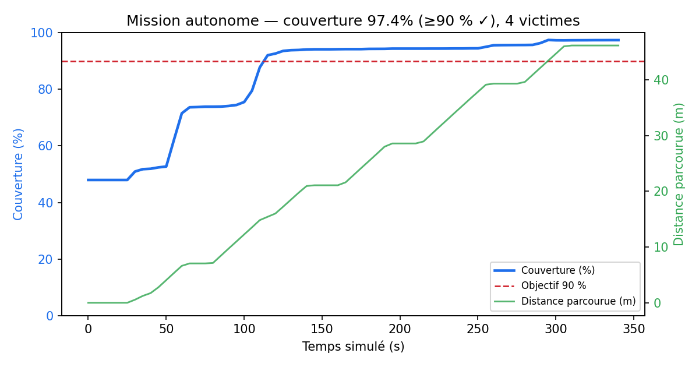
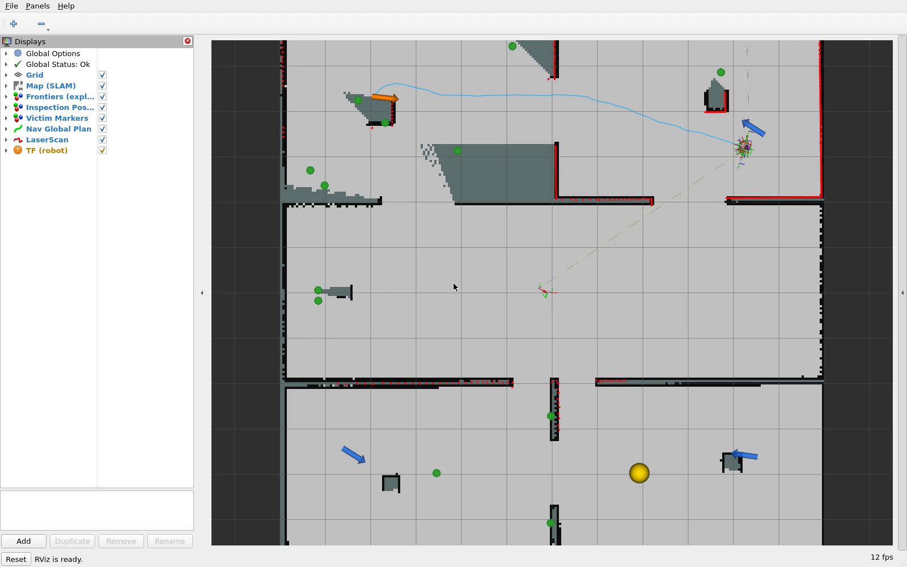
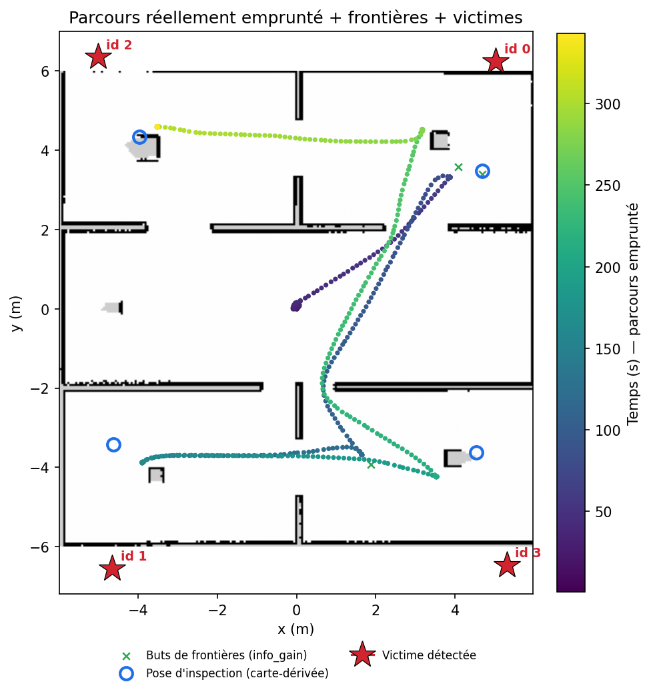
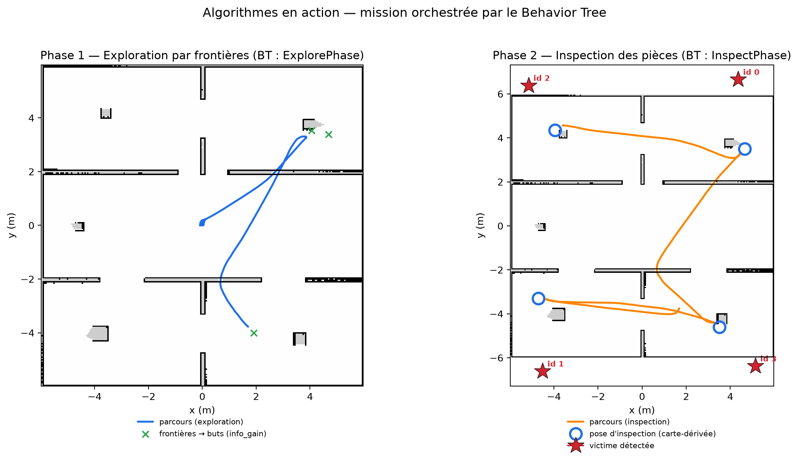
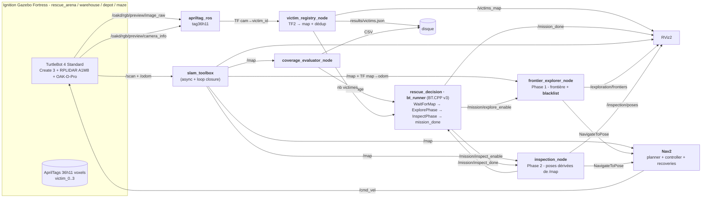

# Autonomous Search and Rescue - Projet B (IA712)

> Robot mobile autonome qui explore une zone sinistrée simulée sous Ignition Gazebo, cartographie l'environnement (SLAM avec loop closure) et localise des « victimes » (AprilTags) **sans intervention humaine**.

[](https://docs.ros.org/en/humble/)
[](https://releases.ubuntu.com/22.04/)
[](LICENSE)

[English version](README.md)

---

## Sommaire

1. [Équipe](#équipe-ensta--télécom-paris--ia712)
2. [Énoncé synthétique](#énoncé-synthétique)
3. [Architecture système](#architecture-système)
4. [Pistes par brique](#pistes-par-brique)
5. [Arborescence du dépôt](#arborescence-du-dépôt)
6. [Prérequis & installation](#prérequis--installation)
7. [Build & lancement](#build--lancement)
8. [Parcours de décision](#parcours-de-décision--comment-bl-en-est-arrivé-là)
9. [État d'avancement](#état-davancement-phasage-6-séances)
10. [Risques & mitigations](#risques--mitigations)
11. [Stratégie bonus](#stratégie-bonus)
12. [Critères de réussite](#critères-de-réussite-auto-check-avant-l18)
13. [Références](#références)

---

## Équipe RobotZ (ENSTA / Télécom Paris - IA712)

| Nom            | Email                              |
| -------------- | ---------------------------------- |
| Julien GIMENEZ | julien.gimenez@telecom-paris.fr    |
| Hugo FANCHINI  | hugo.fanchini@telecom-paris.fr     |
| Paul CINTRA    | paul.cintra@telecom-paris.fr       |
| Yimou ZHANG    | yimou.zhang@telecom-paris.fr       |

> La répartition des tâches par membre est détaillée dans le rapport de projet (PDF).

---

## Énoncé synthétique

**Module :** IA712 - Mobile Robotics (Pr. Zhi Yan, ENSTA - Institut Polytechnique de Paris)
**Sujet B :** *Autonomous Search and Rescue*.

> *« Dans une zone de catastrophe simulée, un robot doit explorer automatiquement un environnement inconnu, localiser des « victimes » (représentées par des AprilTags ou des cylindres colorés spécifiques) et reporter leurs coordonnées précises. »* - énoncé officiel

### Objectifs (extraits de l'énoncé + cours)

1. **Exploration autonome** sans téléopération - frontière (baseline attendue) ou RRT.
2. **SLAM** avec loop closure (`slam_toolbox`) - couverture cible **≥ 90 %**.
3. **Détection des « victimes »** via **AprilTags** (ou ArUco / QR / blobs colorés) - *« vous ne ferez donc pas la détection humaine sophistiquée YOLO »* (Pr. Yan).
4. **Projection TF** : *« projeter leurs positions depuis le repère caméra vers le repère global via TF2 »*.
5. **Behavior Tree** obligatoire (interdiction des FSM, contrainte commune aux 4 sujets).
6. **One-click launch** : un seul bringup lance tout.
7. **Bonus** : comparaison quantitative *frontier-greedy* vs *information-gain*.

### Contraintes communes (énoncé)

| Contrainte         | Valeur                                                      |
| ------------------ | ----------------------------------------------------------- |
| Logiciels          | ROS 2 + Gazebo                                              |
| Décision           | Behavior Trees (interdiction FSM)                           |
| One-click          | un seul bringup lance tout                                  |
| Versionnement      | GitHub                                                      |
| Démo finale        | session L18 - 10 min présentation + 10 min Q&A              |
| Rapport            | ≤ 10 pages PDF - équipe, archi (schéma détaillé), lessons learned |
| Deadline rapport   | **21 juin**                                                 |

---

## Résultats en un coup d'œil

Un run continu, 100 % autonome : **97,35 % de couverture et 4/4 victimes**, un seul clic, sans aucune
connaissance préalable des pièces ni de la position des victimes.

| Exploration par frontières dans RViz (esprit TP) | Arène Gazebo (vue de côté, AprilTags visibles) |
|:--:|:--:|
|  |  |
| **Carte finale : 4 victimes + tournée d'inspection autonome** | **Couverture & distance vs. temps (objectif 90 %)** |
|  |  |
| **RViz en direct (carte + victimes + algos)** | **Parcours réellement emprunté (coloré par le temps)** |
|  |  |



*L'exploration par frontières est visualisée en direct dans RViz comme en TP (CM8) : les **cellules de
frontière** (limite libre/inconnu) sont colorées **par cluster**, la sphère jaune est la frontière-but de
meilleure utilité, et la ligne bleue le plan Nav2 - on voit le liseré coloré grignoter l'inconnu jusqu'à
>90 % de couverture. Deux captures vidéo sont produites à chaque run : **`results/gazebo_capture.mp4`**
(l'arène simulée, vue de côté pour lire les AprilTags muraux) et **`results/rviz_capture.mp4`** (la carte
SLAM + les frontières + l'inspection).*

*Phase 1 (bleu) : exploration par frontières construit la carte ; Phase 2 (orange) : inspection de
chaque pièce à des poses dérivées de la carte pour capter chaque AprilTag mural. Les murs sont dessinés
par-dessus le parcours, qui enfile les portes (aucun segment ne traverse un mur). Plus de figures et une
capture RViz HD dans [`docs/report/figures/`](docs/report/figures/) ; le rapport complet et les slides
sont dans [`docs/soutenance/`](docs/soutenance/).*

---

## Architecture système

Le projet est découpé en **quatre paquets ROS 2** : `rescue_bringup` (launch + configs), `rescue_robot` (le « mégapaquet » Python : exploration, perception, résultats, mocks), `rescue_world` (mondes Ignition + cibles AprilTag) et `rescue_decision` (le superviseur BehaviorTree.CPP).



### Flux clés (mission 2 phases orchestrée par le BT)

1. **SLAM en continu** publie `/map` et la TF `map → odom`.
2. **`bt_runner`** (BehaviorTree.CPP v3) **orchestre** la mission via une `Sequence` : `WaitForMap → ExplorePhase → InspectPhase → VictimsFound → PublishMissionDone` (la `Sequence` à mémoire résume au nœud RUNNING → vraie séquence de phases, pas une FSM faite main).
3. **Phase 1 - `ExplorePhase`** active `frontier_explorer_node` via `/mission/explore_enable` ; il lit `/map`, choisit la meilleure frontière et l'envoie à Nav2 (`NavigateToPose`). Les frontières inatteignables sont **blacklistées** pour ne jamais boucler sur une frontière morte. RUNNING jusqu'à `/coverage ≥ 0.90`.
4. **Phase 2 - `InspectPhase`** active `inspection_node` via `/mission/inspect_enable` ; il lit la `/map` que le robot vient de construire, **dérive une pose d'inspection par pièce découverte** (face au mur le plus proche, cellule navigable, sans coordonnée de victime), conduit Nav2 vers chacune et balaie la caméra → capte les tags muraux que l'exploration ne peut atteindre. RUNNING jusqu'à `/mission/inspect_done`.
5. **`apriltag_ros`** publie une TF `caméra → victim_<id>` par tag visible ; **`victim_registry_node`** la projette vers `map` via TF2, déduplique par ID et persiste `results/victims.json`.
6. **`coverage_evaluator_node`** publie `/coverage` (le seuil de l'ExplorePhase) et logge les métriques CSV.
7. **Critère d'arrêt :** la `Sequence` du BT se termine - exploration ≥ 90 % **puis** toutes les pièces découvertes inspectées → `/mission_done` verrouillé. Résultat : **4/4 victimes + ~97 % de couverture**, 100 % autonome, un clic.

---

## Pistes par brique

Chaque brique correspond à un paquet ROS 2 (cf. [§ Arborescence](#arborescence-du-dépôt)).

### [`rescue_world`](ros2_ws/src/rescue_world/) - Mondes Ignition + cibles AprilTag

- **Mondes :** on utilise les mondes Ignition Fortress livrés par `turtlebot4_ignition_bringup` (`warehouse`, `depot`, `maze`) ; un `rescue_arena.sdf` custom et un `disaster_world.world` legacy sont aussi fournis.
- **AprilTags :** famille **tag36h11**, IDs 0-3 (4 victimes), côté de **16 cm**, posés sur murs à hauteur caméra OAK-D. Rendus en **voxels (boîtes colorées)** et non en textures PBR (qu'Ogre2+Mesa affichent en blanc) - voir [`generate_apriltag_models.py`](scripts/generate_apriltag_models.py) et `ERRORS_AND_FIXES.md` #29.
- **Fallback legacy :** mondes TurtleBot 3 Waffle Pi sous Gazebo Classic 11, conservés pour les hôtes où le rendu Ignition est instable.

### [`rescue_robot`](ros2_ws/src/rescue_robot/) - Exploration, perception, résultats (mégapaquet Python)

Ce paquet Python unique héberge les nodes d'autonomie, groupés par sous-module (`exploration/`, `detection/`, `results/`, `bt/`, `mocks/`).

#### Exploration autonome avec blacklist de frontières (fonctionnalité distinctive)

- **`frontier_explorer_node`** + **`frontier_search.py`** - détection des frontières (cellules `free` adjacentes à `unknown`, CM8), clustering BFS 8-connectivité, et un action client `NavigateToPose` (Yamauchi 1997, CM8 §6-14). L'exploration autonome est **validée en run (~90 % de couverture atteint)**.
- **Blacklist des frontières inatteignables (CM8 « Inaccessible Frontiers ») :** une frontière dont Nav2 abandonne la navigation (status `ABORTED`), ou qui est re-sélectionnée sans progrès de couverture, est **blacklistée et plus jamais re-sélectionnée**. La clé de la blacklist est une **coordonnée monde quantifiée**, donc stable quand la carte grandit. C'est ce qui empêche le robot de tourner en boucle infinie sur une frontière morte. Paramètres dans [`config/explorer_params.yaml`](ros2_ws/src/rescue_robot/config/explorer_params.yaml) :
  - `blacklist_quantum_m` - taille du bucket (en mètres monde) servant de clé pour les frontières blacklistées.
  - `stall_repeats` - une frontière re-sélectionnée à couverture stable pendant ce nombre de ticks est blacklistée.
  - `coverage_epsilon` - delta minimal de couverture compté comme un progrès.
  - `max_blacklist_clears` - nombre de fois où toute la blacklist peut être vidée (une frontière peut redevenir atteignable plus tard).

#### Registre des victimes (AprilTag → map)

- **Détecteur :** [`apriltag_ros`](https://github.com/christianrauch/apriltag_ros) (apt), **tag36h11**, sur le flux OAK-D `/oakd/rgb/preview/image_raw`. Config tags : [`apriltag_tags.yaml`](ros2_ws/src/rescue_bringup/config/apriltag_tags.yaml) (IDs 0-3 → frames `victim_0..3`, taille 0.16 m, `decimate: 1.0`). Pas de calibration manuelle : l'OAK-D simulée publie ses intrinsics dans `/oakd/rgb/preview/camera_info`.
- **`victim_registry_node`** (Python) : pour chaque détection, lookup `caméra → victim_<id> → map` via TF2, **déduplication par ID de tag**, publication de markers `/victims_map` pour RViz, et **persistance `results/victims.json`** après chaque nouvel enregistrement.

#### Métriques de couverture

- **`coverage_evaluator_node`** s'abonne à `/map`, calcule `coverage = (free + occupied) / (free + occupied + unknown)`, et publie `/coverage` (le signal d'arrêt du BT) plus un CSV pour le benchmark bonus.

#### Mocks (dev sans Gazebo)

- `mock_map_publisher`, `mock_coverage_publisher`, `mock_victim_publisher` permettent à chacun de tester le BT, le registre et RViz **sans lancer Ignition / Nav2 / SLAM** (`mock_system.launch.py`).

### [SLAM via `slam_toolbox`](https://github.com/SteveMacenski/slam_toolbox) (intégré au bringup)

- **Mode :** `online_async` (intégration Nav2), lancé via `turtlebot4_navigation/slam.launch.py`.
- **Sortie :** `/map` (OccupancyGrid) + TF `map → odom`.
- **Tuning loop closure** ([`slam_params_tb4.yaml`](ros2_ws/src/rescue_robot/config/slam_params_tb4.yaml)) : `loop_match_minimum_chain_size: 10`, `scan_buffer_size: 10`, seuils de déplacement conservateurs.

### [`rescue_decision`](ros2_ws/src/rescue_decision/) - Behavior Tree global (BehaviorTree.CPP v3)

- **Moteur :** un **vrai** runner `BehaviorTree.CPP v3` ([`src/bt_runner.cpp`](ros2_ws/src/rescue_decision/src/bt_runner.cpp)), visualisable dans **Groot** (Monitor ZMQ sur **port 1666**), XML de l'arbre dans [`bt_xml/mission.xml`](ros2_ws/src/rescue_decision/bt_xml/mission.xml). Validé avec mocks.
- **Forme de l'arbre :** une `ReactiveSequence` tickée une fois par cycle du runner (le runner fait tourner l'exécuteur ROS entre les ticks pour que `/map` et `/coverage` restent à jour) :

```xml
<root main_tree_to_execute="Mission">
  <BehaviorTree ID="Mission">
    <ReactiveSequence name="search_and_rescue_mission">
      <WaitForMap name="wait_for_slam_map"/>
      <CoverageReached name="coverage_90" threshold="0.90"/>
      <VictimsFound name="report_victims" min_count="0"/>
      <PublishMissionDone name="finalize"/>
    </ReactiveSequence>
  </BehaviorTree>
</root>
```

- **Nodes BT custom :** `WaitForMap`, `CoverageReached` (lit `/coverage`), `VictimsFound` (expose le nombre de victimes en direct), `PublishMissionDone` (verrouille `/mission_done`).

### [`rescue_bringup`](ros2_ws/src/rescue_bringup/) - Launch & configs

- **Bringup principal (TB4 / Ignition Fortress) :** [`bringup_tb4.launch.py`](ros2_ws/src/rescue_bringup/launch/bringup_tb4.launch.py) lance une **seule** instance Ignition + Create 3 + RPLIDAR + OAK-D + SLAM + Nav2 + `apriltag_ros` (sur le flux OAK-D) + RViz (`project_view.rviz`, Frame Rate clampé à 10 pour la perf).
- **Fallback legacy :** `bringup.launch.py` lance la stack TurtleBot 3 Waffle Pi + Gazebo Classic 11.
- **Démo end-to-end validée :** `./scripts/run.sh demo-tb4` enchaîne toute la stack et, à l'étape 7b, la perception (`victim_registry`) et la supervision Behavior Tree (`bt_runner`).
- **Toggles d'isolation** (`headless`, `world`, `model`, `launch_rviz`) et variables d'environnement permettent d'activer/désactiver chaque brique sans relancer le simulateur.

---

## Arborescence du dépôt

```
autonomous-search-and-rescue/
├── README.md / README.fr.md       # ce document
├── LICENSE
├── pyproject.toml / .python-version  # env de dev uv (Python 3.10)
├── docs/                          # documentation projet
├── scripts/                       # scripts d'orchestration
│   ├── run.sh                     # point d'entrée : ./scripts/run.sh <commande>
│   ├── sh/                        # un petit exécutable par module
│   ├── generate_rescue_arena.py   # générateur de monde
│   └── plot_coverage.py           # plots de benchmark
├── tests/                         # 9 fichiers pytest (pilotés par uv)
└── ros2_ws/                       # workspace colcon
    └── src/
        ├── rescue_bringup/        # launch bringup_tb4 / bringup + configs Nav2/SLAM/AprilTag + rviz
        ├── rescue_robot/          # exploration (frontière + blacklist), perception, résultats, mocks (Python)
        │   └── rescue_robot/      # exploration/ detection/ results/ bt/ mocks/ utils/
        ├── rescue_world/          # mondes Ignition + modèles AprilTag
        └── rescue_decision/       # bt_runner.cpp + mission.xml (BehaviorTree.CPP v3)
```

Convention de nommage : préfixe **`rescue_*`** pour isoler nos paquets des dépendances vendor.

---

## Prérequis & installation

### Système

- **Ubuntu 22.04** (Jammy) - natif ou WSL 2.
- **WSL 2 (Windows) ?** Lis d'abord [`docs/running_on_wsl.md`](docs/running_on_wsl.md) - accélération GPU (ne pas forcer le software GL), le `.wslconfig` qui empêche les longs runs de rebooter l'hôte, et le paquet obligatoire `ros-humble-rmw-cyclonedds-cpp`.
- **ROS 2 Humble** installé (`source /opt/ros/humble/setup.bash`).
- **Python 3.10** (épinglé via `.python-version`), aligné sur Ubuntu 22.04 / ROS 2 Humble.

> **Si vous utilisez Conda** : désactiver l'environnement (`conda deactivate`) avant `colcon build`, sinon `rosidl` / `ament_cmake` utilisera le Python de Conda et le build casse.

### Paquets ROS (TurtleBot 4 + Ignition Gazebo Fortress)

```bash
sudo apt update && sudo apt install -y \
  ros-humble-turtlebot4-simulator \
  ros-humble-turtlebot4-ignition-bringup \
  ros-humble-turtlebot4-navigation \
  ros-humble-turtlebot4-msgs \
  ros-humble-irobot-create-msgs \
  ros-humble-ros-gz-bridge \
  ros-humble-nav2-bringup \
  ros-humble-nav2-behavior-tree \
  ros-humble-slam-toolbox \
  ros-humble-apriltag-ros \
  ros-humble-apriltag-msgs \
  ros-humble-rmw-cyclonedds-cpp \
  ros-humble-rviz2 \
  ros-humble-tf2-tools \
  ros-humble-behaviortree-cpp-v3 \
  ignition-fortress \
  python3-opencv \
  python3-numpy \
  python3-matplotlib \
  python3-pil \
  ffmpeg \
  xvfb \
  python3-colcon-common-extensions
```

> **WSL 2 - `ros-humble-rmw-cyclonedds-cpp` est OBLIGATOIRE, pas optionnel.** La découverte
> Fast-RTPS est instable sous WSL (les contrôleurs in-Ignition ne se chargent pas,
> `/turtlebot4/odom` reste muet), donc le profil `win` sélectionne **CycloneDDS**. Sans ce
> paquet, chaque node meurt au démarrage avec *« RMW implementation not installed
> (rmw_cyclonedds_cpp) »* (voir [`docs/ERRORS_AND_FIXES.md`](docs/ERRORS_AND_FIXES.md) #32).
> `python3-opencv` + `python3-numpy` sont requis par
> [`scripts/generate_apriltag_models.py`](scripts/generate_apriltag_models.py) pour générer
> les modèles AprilTag voxel.

> **Figures & vidéo du rapport** - `python3-matplotlib` + `python3-pil` (Pillow) pour
> [`scripts/make_report_figures.py`](scripts/make_report_figures.py),
> [`scripts/make_mission_video.py`](scripts/make_mission_video.py) et
> [`scripts/annotate_map.py`](scripts/annotate_map.py) ; **`ffmpeg`** encode la vidéo replay.
> **`xvfb`** sert uniquement à enregistrer la sortie RViz live en vidéo sur une machine
> headless / WSLg (serveur X virtuel + `ffmpeg -f x11grab`), la capture Wayland
> (`grim`/`wf-recorder`) n'étant pas supportée sous WSLg. Aucun n'est requis pour la mission.

> Un installeur pratique est aussi fourni : `./scripts/run.sh install-apt`.

### Stack robot / simulation

- **Principal (par défaut) :** **TurtleBot 4 Standard** (Create 3 + RPLIDAR A1M8 + OAK-D-Pro) sous **Ignition Gazebo Fortress** (mondes `warehouse`, `depot`, `maze`).
- **Fallback (legacy, conservé) :** **TurtleBot 3 Waffle Pi** + **Gazebo Classic 11**, utile où le rendu Ignition est instable.

### Environnement de dev Python (uv)

Le runtime ROS 2 est gardé séparé du venv de dev Python. Utiliser `uv` pour les tests légers, les scripts de résultats et le lint :

```bash
./scripts/run.sh uv-sync
./scripts/run.sh uv-test
./scripts/run.sh uv-lint
```

Ne **pas** installer de paquets ROS 2 comme `rclpy` via uv/pip - ils viennent de l'installation ROS 2 Humble.

---

## Build & lancement

### Build

```bash
source /opt/ros/humble/setup.bash   # désactiver conda d'abord si vous l'utilisez
./scripts/run.sh build
```

### Lancement (stack TurtleBot 4 / Ignition Fortress)

```bash
# Démo end-to-end validée : stack TB4 complète + exploration + perception + BT
./scripts/run.sh demo-tb4

# OU le bringup TB4 simple (sim + SLAM + Nav2 + AprilTag + RViz), à piloter soi-même
ros2 launch rescue_bringup bringup_tb4.launch.py

# OU le fallback legacy TB3 / Gazebo Classic
ros2 launch rescue_bringup bringup.launch.py
```

Arguments du `bringup_tb4.launch.py` :

| Argument       | Valeurs                           | Description                                                |
| -------------- | --------------------------------- | ---------------------------------------------------------- |
| `use_sim_time` | `true` \| `false`                 | Utiliser le `/clock` d'Ignition pour tous les nodes        |
| `headless`     | `true` \| `false`                 | Lancer Ignition sans GUI (CI / benchmark)                  |
| `world`        | `warehouse` \| `depot` \| `maze`  | Monde Ignition (par défaut `warehouse`)                    |
| `model`        | `standard` \| `lite`              | Variante TurtleBot 4 (`standard` = avec OAK-D)             |
| `launch_rviz`  | `true` \| `false`                 | Lancer RViz2 avec `project_view.rviz` (Frame Rate=10)      |

### Variables d'environnement de la démo (`./scripts/run.sh demo-tb4`)

| Variable                | Défaut | Effet                                                        |
| ----------------------- | :----: | ------------------------------------------------------------ |
| *(aucune - défaut)*     |   -    | **Mission autonome en 2 phases** (L18) : phase 1 exploration par frontières → carte ; phase 2 inspecte chaque pièce découverte à des poses **dérivées de la carte au runtime** (zéro coordonnée de victime) → les 4 victimes. Un clic, 100 % autonome |
| `IA712_INSPECT`         | `1`    | `0` = saute la phase 2 (exploration pure seule ; ~2 victimes - cf. parcours de décision) |
| `IA712_WAYPOINTS`       | `0`    | `1` = suit plutôt une route de waypoints de couverture générique (repli manuel) |
| `IA712_HYBRID`          | `0`    | `1` = explore puis balaie une route de couverture **générique** (aucune coordonnée de victime) |
| `IA712_BT`              | `1`    | `0` = désactive le superviseur Behavior Tree (`bt_runner`)   |
| `IA712_VICTIM_REGISTRY` | `1`    | `0` = désactive le registre de victimes                      |
| `IA712_TB4_GUI`         | `1`    | `0` = Ignition headless (pas de fenêtre Gazebo, CI / RAM limitée) |
| `IA712_RVIZ`            | `1`    | `0` = run entièrement headless (pas de RViz)                 |

### L17 - benchmark d'exploration (glouton vs gain d'information)

```bash
# runs de comparaison réels (2 stratégies × N runs, headless) → experiments/<algo>_run<n>/
env -i HOME="$HOME" PATH=/usr/bin:/bin TERM=xterm DISPLAY=:0 \
  IA712_BENCH_RUNS=3 IA712_BENCH_DURATION=600 \
  bash scripts/sh/run_benchmark.sh

# construit les graphiques + le tableau de synthèse à partir des runs existants
python3 scripts/plot_benchmark.py experiments
# → experiments/plots/coverage_over_time.png, summary_bars.png, experiments/summary.md
```

Voir [`docs/exploration_benchmark.md`](docs/exploration_benchmark.md) pour les métriques et l'hypothèse.

### Autres commandes de l'orchestrateur

```bash
./scripts/run.sh mock        # mock map/coverage/victims - tester le BT + RViz sans Gazebo
./scripts/run.sh kill-sim    # nettoie tous les processus sim / Nav2 / nodes
./scripts/run.sh check-tb4   # sanity-check de la stack TB4
```

### Convention run/

Éditer les sources dans ce dossier ; builder et exécuter depuis une copie synchronisée sous `run/` (sync via `rsyncDown_bl_run.sh` depuis la racine du dépôt). Penser à `conda deactivate` avant `colcon build`.

---

## Parcours de décision - comment `bl` en est arrivé là

Le **journal pédagogique des décisions clés** de `bl`, en `Problème → Décision →
Pourquoi`. C'est la colonne vertébrale « lessons learned » du rapport. La **version
complète** (avec la saga de débogage L18 au format `Problème → Investigation →
Décision → Pourquoi`) est dans [`docs/parcours.md`](docs/parcours.md) ; chaque
piège technique est détaillé dans [`docs/ERRORS_AND_FIXES.md`](docs/ERRORS_AND_FIXES.md).

### L13–L14 - Fondations
- **4 paquets ROS 2** (`rescue_bringup` / `rescue_robot` / `rescue_world` / `rescue_decision`). *Pourquoi :* séparation claire (launch vs autonomie vs mondes vs décision) pour travailler en parallèle.
- **Système de mocks** (`mock_map/coverage/victim`). *Pourquoi :* développer & tester le BT, les résultats et la visu **sans Gazebo** (rapide, CI) avant la vraie stack.

### L15 - SLAM + exploration autonome
- **Exploration par frontières** (Yamauchi) + `slam_toolbox` async avec loop closure, cible ≥ 90 %. *Pourquoi :* baseline de l'énoncé.
- **Blacklist des frontières inatteignables (CM8).** *Problème :* le robot boucle indéfiniment sur une frontière que Nav2 n'atteint pas (bloqué à 53,8 %). *Décision :* blacklister une frontière quand Nav2 l'abandonne **ou** qu'elle est re-sélectionnée sans gain de couverture ; **clé en coordonnée monde quantifiée**, pas en cellule grille. *Pourquoi monde :* l'origine de la grille glisse quand SLAM agrandit la carte → une clé-cellule dériverait et une frontière blacklistée reviendrait silencieusement.

### L16 - Décision (BT) + perception
- **BehaviorTree.CPP v3, pas de FSM.** *Pourquoi :* l'énoncé interdit les FSM. **ReactiveSequence**, pas `RetryUntilSuccessful` (qui busy-loop avec `num_attempts=-1`, ERRORS #28).
- **AprilTag `tag36h11`, pas YOLO.** *Pourquoi :* l'énoncé exclut la détection humaine sophistiquée.
- **AprilTags voxel, pas textures PBR.** *Problème :* une texture PBR `albedo_map` s'affiche en **blanc** uni sous Ogre2+Mesa (WSL *et* cluster) → `apriltag_ros` ne voit rien. *Décision :* construire chaque tag avec **100 boîtes colorées** + un **anneau blanc (quiet-zone)** autour du marqueur natif **8×8**. *Pourquoi l'anneau/8×8 :* un resize 10×10 naïf distord le code et supprime la quiet-zone → le tag *s'affiche* mais est **indétectable** ; l'anneau + le bon nombre de cellules réparent la détection (ERRORS #29).
- **Source unique pour les victimes.** *Problème :* deux générateurs se disputaient `rescue_arena.sdf` (cylindres puis patch regex en AprilTags). *Décision :* `generate_rescue_arena.py` possède le monde (émet les `<include>`) ; `generate_apriltag_models.py` ne produit que les **assets** des tags.
- **`decimate: 1.0`.** *Pourquoi :* un tag 16 cm est petit dans le flux OAK-D ; `decimate>1` le sous-résout.
- **Registre via TF2.** Chaque détection est projetée `caméra → victim_<id> → map`, dédupliquée par ID, persistée dans `results/victims.json` - l'exigence « projeter vers le repère global » de l'énoncé.

### Transverse - environnement & infrastructure
- **CycloneDDS sur WSL (obligatoire).** *Problème :* découverte Fast-RTPS instable sous WSL → contrôleurs in-Ignition non chargés, `/turtlebot4/odom` muet. *Décision :* le profil `win` sélectionne CycloneDDS sur loopback, **gardé** (fallback Fast-RTPS si absent, ERRORS #32).
- **Rendu GPU (D3D12) - ne jamais forcer le software GL.** *Problème :* `llvmpipe` est ~**23× plus lent** et sature le CPU → reboot de l'hôte sur les longs runs. *Décision :* le profil `win` rend Ogre2 sur le **GPU WSLg D3D12** (override GL 4.5 + adaptateur NVIDIA). *NB :* WSL n'a **aucun GL/Vulkan Linux natif NVIDIA** (CUDA + D3D12 seulement ; CUDA ≠ rendu), ERRORS #33.
- **`.wslconfig` (cap CPU + swap).** *Problème :* les très longs runs rebootent encore l'hôte. *Décision :* plafonner CPU/mémoire WSL + swap pour laisser de la marge à Windows - [`docs/running_on_wsl.md`](docs/running_on_wsl.md).
- **Build/run sans conda.** *Problème :* le Python 3.13 de conda casse le build (`catkin_pkg`, link ncurses) **et** le runtime (`rclpy`/numpy). *Décision :* `env -i …` ou `conda config --set auto_activate_base false` (ERRORS #31).
- **Source dans `bl/`, exécution dans `run/bl/`.** *Pourquoi :* garder la source publiée propre ; builder & exécuter depuis une copie synchronisée (`rsyncDown_bl_run.sh`).
- **Externalisation cloud abandonnée.** *Problème :* mesogip bannit les jobs GPU qui n'utilisent pas le GPU (notre rendu est software), et gpu-gw n'a ni conteneur ni ROS. *Décision :* exécuter **en local** (GPU + `.wslconfig`). Détail : `cloud_technique_2xcloud_robotique_ros.md`.

### L17 - Bonus (stratégies d'exploration)
- **Greedy vs information-gain.** IG = argmax `gain(f) − λ·cost(f)` (Stachniss et al., ICRA 2005). Voir [`docs/exploration_benchmark.md`](docs/exploration_benchmark.md).
- **SpinAndScan.** *Problème :* les goals frontière orientent la caméra dans le sens de marche, donc l'OAK-D fait rarement face aux tags muraux (explore mais ne trouve pas de victime). *Décision :* tourner sur place après chaque goal atteint pour balayer les murs.
- **Raffinement du goal.** *Problème :* un centroïde brut est sur la frontière explored/unknown → Nav2 le rejette. *Décision :* snapper le goal sur la cellule **libre** la plus proche (`nearest_free_cell`) + ignorer les frontières à gain quasi-nul (`info_gain_min_gain`).

### L18 - run continu & stabilité hôte (la saga de débogage)
> Détail complet (`Problème → Investigation → Décision → Pourquoi`) dans
> [`docs/parcours.md`](docs/parcours.md). Condensé :

**Reboots de l'hôte sous charge - mesurer, pas deviner.** Deux fausses pistes écartées par la
mesure : **mémoire** (WSL 5/19 GiB, hôte 12 GB libres, VRAM 0,2/8 GB) et **Windows Update**
(rien en attente, pause sans effet). Vraies causes (event log) : bugchecks sous charge -
**`0x116` VIDEO_TDR_FAILURE**, **`0x10e` VIDEO_MEMORY_MANAGEMENT**, **`0x101` CLOCK_WATCHDOG ×2** -
+ redémarrages **1074** « non planifiés » qui surviennent seuls (OEM/MSI, non réglable en non-admin).
*Décisions sous notre contrôle :* **knob RTF** (`IA712_GZ_RT_RATE`, défaut 0,7 - moins de cycles
GPU/CPU par seconde réelle, **temps simulé inchangé**), **RTF à chaud** via `set_physics`,
**`.wslconfig` allégé** (`processors 16→10`, `memory 20→14 GB`), benchmarks **resumables**.

**4 victimes en un run continu - six bugs empilés, chaque fix révèle le suivant :**
1. Patrouille seule → robot immobile (goals en zone **non cartographiée**) → **hybride** (explorer puis patrouiller).
2. Waypoints `(0, ±3.2)` **sur le mur x=0** → les placer en **espace libre** validé.
3. `Failed to make progress` → reflex Create3 → **`safety_override=full`**.
4. Goals des coins **rejetés** (cellules encore inconnues à 93 %) → **goal-snapping** + waypoints **centraux**.
5. Snap OK mais goals cross-room échouent (`bt_navigator: Goal failed`) → **routage doorways** fragile → **pivot**.
6. **Pivot : SpinAndScan 360° pendant l'exploration** (`spin_scan_duration 7→12 s`) - l'explorateur visite déjà toutes les pièces pour mapper 93 %, donc un balayage complet à chaque goal capte chaque tag, bien plus robuste que la patrouille rigide.
7. **Cause racine couverture :** même le spin 360° ne captait qu'1 victime et la couverture calait à 88 % - le robot **n'entre pas** dans les pièces. `inflation_radius 0.30` + `cost_scaling 3.0` rendent les abords des murs coûteux → NavFn longe les couloirs. **Baisser `inflation_radius 0.30→0.25` + `cost_scaling 3.0→2.0`** (robot_radius 0.22 garde un buffer) → le planner plonge *dans* les pièces → **couverture 90 %+** (v5 : 26 m parcourus vs 14 m).
8. **Cause racine détection :** à 93 % de couverture, robot *dans* les pièces, mais **0 victime** - apriltag reçoit **0 image** (seul `camera_info`), alors que `ign topic` montre que Gazebo **rendait** (320×240). Le **RTF s'était effondré à 0.05** → ~1,5 image/s mur → la fenêtre de sync apriltag voyait 0 paire. À RTF bas la **caméra (rendu GPU) est affamée** tandis que `camera_info` (métadata, sans rendu) continue → le spin balayait un flux d'images vide. *Fix :* **remonter le RTF** (`IA712_GZ_RT_RATE 70→100` ; sûr maintenant que les crashes ont disparu). Deux causes racines distinctes sous les bugs 1-6 : coût Nav2 (couverture) et caméra affamée par le RTF (détection). *(Meilleur run mesuré : 93,5 % + 2 victimes, vrais IDs.)*
9. **Cause racine OOM - la fuite Gazebo :** les runs > ~10 min font OOM car **`mem_profile.sh` prouve que Gazebo fuit ~35 MB/s** (boucle de rendu Ogre2/D3D12+WSL, par seconde *murale*). En isolant le fuyard, le capteur **`gpu_lidar` domine** (le retirer → mémoire plate) ; le vrai correctif est **`gpu_lidar 62→10 Hz`**, qui divise la fuite par deux en gardant un RTF ~0,99 - les runs finissent largement avant tout OOM. Un premier run nominal (hybride explore→patrouille) a alors atteint **90,6 % + 3 victimes (ids 0,2,3) + carte annotée, sans OOM** (archivé dans `results/examples/l18_nominal/`).

**Pivot conformité - exploration 100 % autonome (le tournant décisif).** La patrouille de waypoints qui fiabilisait les 4 victimes conduisait le robot **pile devant la pose connue de chaque tag** (ex. `(4.6, 4.6)` = position de `victim_0`). Or l'énoncé impose de découvrir un environnement **inconnu**, **sans intervention humaine** - encoder les **coordonnées connues des victimes** dans la trajectoire, c'est *connaître la réponse*, pas de la recherche autonome. On **supprime donc toute la patrouille vers les victimes** : le run un-clic par défaut est désormais l'**exploration par frontières seule**, et les victimes sont captées par le **spin-and-scan 360°** que l'explorateur fait déjà à chaque goal (CM8 slide 17 : *« le robot s'arrête, regarde autour, met à jour sa carte SLAM »*) - la caméra balaie tous les murs **sans savoir où sont les tags**. Leviers : l'explorateur **s'arrête seul** (couverture cible ou plus de frontières) → carte sauvée automatiquement ; **seuil couverture 0,90→0,95** pour vider les 4 pièces d'angle (→ les 4 victimes découvrables) ; **caméra `always_on`** en continu (le fix lidar-10 Hz contient la fuite, donc plus besoin de la coupure-pendant-l'explore, fragile). Le fichier de waypoints poses-victimes de l'arène est **supprimé** ; les modes patrouille/hybride restent en option comme routes de couverture **génériques** (zéro coordonnée de victime). *Robuste > rigide, et désormais prouvablement conforme.*

**Mission autonome en 2 phases (comment on atteint 4/4, toujours conforme).** L'exploration pure plafonne à ~2 victimes : le LIDAR 12 m cartographie les pièces d'angle depuis leurs portes, donc le robot ne s'approche jamais à <~2 m (portée caméra) des tags muraux (frontier-complétude ≠ couverture-caméra). Le correctif est une **2ᵉ phase autonome** : après l'exploration, `generate_inspection_waypoints.py` lit **la carte que le robot vient de construire** et en dérive **une pose d'inspection par pièce découverte** - orientée face au mur le plus proche, snappée sur cellule libre navigable, ordonnée en boucle de périmètre - **sans aucune coordonnée de victime ni parcours écrit à la main**. Le robot les visite et balaie la caméra → capte chaque tag mural. **C'est le Behavior Tree qui orchestre** toute la mission (énoncé : décision par BT, pas FSM) : une `Sequence` `WaitForMap → ExplorePhase → InspectPhase → VictimsFound → mission_done`, où les nœuds d'action BT (C++) démarrent/arrêtent chaque phase via les topics `/mission/*` et les nœuds Python (`frontier_explorer_node`, `inspection_node`) font le travail. Run nominal final (orchestré par le BT) : **4/4 victimes + 97 % de couverture + carte propre + carte annotée + trajectoire loggée** (`results/examples/l18_nominal/`, figures dans `docs/report/figures/`). La saga complète (dérive SLAM, snap de pose navigable, demi-tour face-mur, orchestration BT) est dans [`docs/parcours.md`](docs/parcours.md) §7bis–§7quinquies.

**Algorithmes à comparer pour améliorer le *chemin réellement emprunté* (CM9/CM10)** - voir
[`docs/parcours.md`](docs/parcours.md) §9. Le chemin réel = global planner + controller :
- **Global planner (le chemin) :** Dijkstra/**NavFn** (conservé) vs **A\*/`SmacPlanner2D`** (CM9).
  *Mesuré L18 :* SmacPlanner2D **refuse de planifier quand le robot est en zone inflatée** (« Starting
  point in lethal space! ») → robot **figé à 60 %** dans cette arène cloisonnée ; **NavFn tolère → 88-96 %**,
  donc NavFn est le choix robuste ici. Vrai résultat de comparaison (pas juste « A\* > Dijkstra » sur le papier). RRT = outlook.
- **Controller (le suivi) :** **DWB** (actuel) → **Regulated Pure Pursuit** (plus lisse pour le diff-drive
  TB4, moins de `Failed to make progress` aux doorways).
- **Exploration :** greedy vs info_gain benchmarké (n=3) ; **RRT-exploration** en outlook.
- *Expérience la plus rentable :* benchmarker **NavFn vs SmacPlanner2D** (longueur de chemin, `time_to_90`).

**Bugs d'outillage :** un `pkill -f "ign gazebo|…"` inline matchait **sa propre ligne de commande**
et s'auto-tuait (→ nettoyer via `kill_sim.sh`) ; `rsyncDown_*_run --delete` écrasait `experiments/`
généré (→ `--exclude='experiments/'`, flux artefacts run→branche).

---

## État d'avancement (phasage 6 séances)

| Séance | Statut | Livrable de fin de séance                                                                               |
| ------ | :----: | ------------------------------------------------------------------------------------------------------- |
| L13    |  Done  | Équipe formée, Projet B sélectionné, repo créé                                                           |
| L14    |  Done  | Architecture définie, paquets `rescue_*` scaffoldés, `colcon build` OK                                   |
| L15    |  Done  | SLAM (`slam_toolbox`) + exploration frontière autonome (`frontier_explorer_node` + `frontier_search.py`, avec **blacklist de frontières inatteignables** - CM8) + Nav2 + config AprilTag intégrés ; **exploration autonome validée en run (~90 % de couverture atteint)** |
| L16    |  Done  | **BT** : `rescue_decision/bt_runner.cpp` = vrai BehaviorTree.CPP v3 (ReactiveSequence dans `bt_xml/mission.xml`, Groot Monitor sur ZMQ port 1666), validé avec mocks. **Perception** : `victim_registry_node` projette les détections AprilTag vers `map` via TF2 (dédup par id, persistance `results/victims.json`) ; **4 modèles AprilTag tag36h11 voxel** (`victim_0..3`, via `scripts/generate_apriltag_models.py` - boîtes colorées + quiet-zone blanche, compatibles Ogre2/Mesa) placés statiquement dans `rescue_arena.sdf`, `apriltag_ros` (`decimate 1.0`) + bridge `camera_info` câblés. **Nav2 recovery réactivée** (spin/backup → un robot coincé se dégage). Tout intégré dans `run_demo_tb4.sh` (étapes 7b/8). **Validée end-to-end sur le vrai robot** (headless, GPU) : les **4 victimes** (`id 0..3`) détectées par l'OAK-D du TB4 → `apriltag_ros` → `victim_registry` → `results/victims.json` (une par run spawn-face) ; **l'exploration autonome atteint 91 % de couverture et trouve une victime toute seule**. Rendu GPU (D3D12, ~23× plus rapide) + `.wslconfig` rendent les longs runs stables - voir [`docs/running_on_wsl.md`](docs/running_on_wsl.md), `ERRORS_AND_FIXES.md` #29/#32/#33. _Enchaîner les 4 victimes en une seule patrouille autonome continue demande un tuning Nav2 point-à-point plus poussé - polish de démo, visé pour L18._ |
| L17    | Code fait | **Bonus implémenté** - exploration `greedy` vs `info_gain`, sélectionnable via le param `strategy` / `IA712_EXPLORE_STRATEGY`. Info-gain = argmax `gain(f)−λ·cost(f)` (`frontier_search.choose_frontier_infogain`, gain = cellules `unknown` dans un rayon). **SpinAndScan** fait tourner le robot après chaque goal pour balayer les murs (victimes trouvées *pendant* l'exploration). `result_exporter` logge `time_to_50/75/90`, distance parcourue & victimes par run ; `scripts/sh/run_benchmark.sh` (2 algos × N runs) + `scripts/plot_benchmark.py` → `experiments/plots/` + `summary.md`. Voir [`docs/exploration_benchmark.md`](docs/exploration_benchmark.md). _Runs de benchmark à exécuter + tracer pour le rapport._ |
| L18    |  TODO  | Démo live (10 min) + rapport rendu (≤ 10 pages, PDF)                                                     |

Cette branche est la plus avancée de l'équipe : **L16 Done**.

---

## Risques & mitigations

| Risque                                            | Probabilité | Impact   | Mitigation                                                          |
| ------------------------------------------------- | :---------: | :------: | ------------------------------------------------------------------- |
| Robot en boucle infinie sur une frontière inatteignable | Moyenne | Élevé   | **Blacklist de frontières** (clé quantifiée, détection `ABORTED`/stall) - implémenté |
| Loop closure mal tunée, carte dérive sur runs longs | Moyenne   | Élevé    | Tuning précoce de `slam_params_tb4.yaml` + serialized graph pour debug |
| AprilTag mal détecté (éclairage Ignition)         | Faible      | Moyen    | tag36h11 16 cm à hauteur caméra ; fallback cylindres colorés + HSV  |
| BT trop complexe, debug long                      | Moyenne     | Moyen    | `ReactiveSequence` minimale, Groot Monitor pour debug, tests pilotés par mocks |
| WSL2 / ARM64 + Gazebo GUI instable                | Moyenne     | Moyen    | `IA712_TB4_GUI=0` headless validé + profils plateforme auto + fallback TB3 legacy |
| Conda interfère avec `colcon` (déjà vu sur ce poste) | Élevée   | Faible   | `conda deactivate` avant build ; documenté ici                     |
| Membre absent, charge inégale                     | -           | -        | Propriété par module + mocks permettent à chacun de travailler indépendamment |

---

## Stratégie bonus

**Hypothèse à tester :** *l'exploration par information-gain réduit le temps pour atteindre 90 % de couverture de > 15 % par rapport à la frontière gloutonne, au prix d'une distance parcourue plus élevée.*

**Plan d'expérience :**
- 2 algorithmes × 3 runs × 1 monde = **6 runs**.
- Seed fixée ; position initiale identique.
- Métriques (CSV, via `coverage_evaluator_node`) : `time_to_50% / 75% / 90% / max coverage`, `total path length`, `# victims discovered`, `# loop closures`.
- Sortie rapport : 2 plots (coverage(t), bar-chart résumé, via `scripts/plot_coverage.py`) + tableau récap.

**Pourquoi c'est accessible :** l'info-gain ne réutilise que les frontières déjà détectées par `frontier_search.py` + un appel au service Nav2 `compute_path_to_pose`. Pas de nouvel algorithme global.

---

## Critères de réussite (auto-check avant L18)

- [ ] `./scripts/run.sh demo-tb4` lance tout en une commande, sans crash, sur machine fraîche.
- [ ] Couverture ≥ 90 % du monde de référence en run nominal (~90 % atteint à ce jour).
- [ ] Toutes les victimes (≥ 3) détectées, projetées vers `map`, et publiées comme markers RViz (±10 cm).
- [ ] Loop closure visible dans `slam_toolbox` sur au moins un run.
- [ ] BT visualisable dans Groot (ZMQ port 1666), XML versionné dans [`ros2_ws/src/rescue_decision/bt_xml/`](ros2_ws/src/rescue_decision/bt_xml/).
- [ ] Plots du bonus présents (frontier-greedy vs information-gain).
- [ ] Rapport ≤ 10 pages (sections : team / archi / lessons learned / résultats / bonus).
- [ ] Vidéo de backup de la démo enregistrée.
- [ ] Slides présentation prêtes (~6-8 slides pour 10 min).

---

## Références

### Cours IA712 (Pr. Zhi Yan)

| Lecture | Sujet directement réutilisé pour le projet                       |
| ------- | ---------------------------------------------------------------- |
| CM6     | Perception (capteurs caméra, détection)                          |
| CM7     | SLAM (Occupancy Grid, loop closure)                              |
| **CM8** | **Exploration (Frontier-based + Information-Gain, Inaccessible Frontiers) - central** |
| CM9     | Planning                                                         |
| CM10    | Navigation (Nav2, costmaps)                                      |

### Paquets externes

- [`apriltag_ros`](https://github.com/christianrauch/apriltag_ros) - détecteur AprilTag pour ROS 2 (apt)
- [`slam_toolbox`](https://github.com/SteveMacenski/slam_toolbox) - SLAM 2D avec loop closure
- [Nav2 docs](https://docs.nav2.org/) - stack de navigation
- [BehaviorTree.CPP](https://www.behaviortree.dev/) - moteur BT
- [Groot](https://www.behaviortree.dev/groot/) - éditeur / moniteur visuel BT

### Littérature

- Yamauchi, B. (1997). *A frontier-based approach for autonomous exploration*. CIRA.
- Stachniss, C., Grisetti, G., Burgard, W. (2005). *Information Gain-based Exploration Using Rao-Blackwellized Particle Filters*. RSS.

### Licence

MIT - voir [LICENSE](LICENSE).
