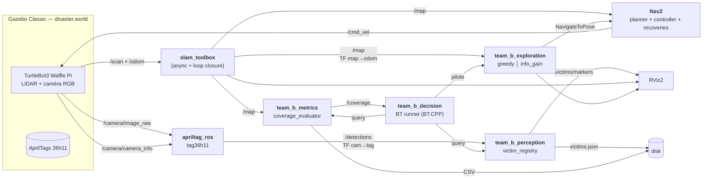

# Autonomous Search and Rescue — Projet B (IA712)

> Robot mobile autonome qui explore une zone sinistrée simulée sous Gazebo, cartographie l'environnement (SLAM avec loop closure) et localise des « victimes » (AprilTags) **sans intervention humaine**.

[](https://docs.ros.org/en/humble/)
[](https://releases.ubuntu.com/22.04/)
[](LICENSE)

[English version](README.md)

---

## Sommaire

1. [Équipe](#équipe-ensta--télécom-paris--ia712)
2. [Énoncé synthétique](#énoncé-synthétique)
3. [Architecture système](#architecture-système)
4. [Pistes par brique](#pistes-par-brique)
5. [Arborescence du dépôt](#arborescence-du-dépôt)
6. [Prérequis & installation](#prérequis--installation)
7. [Build & lancement](#build--lancement)
8. [État d'avancement](#état-davancement-phasage-6-séances)
9. [Risques & mitigations](#risques--mitigations)
10. [Stratégie bonus](#stratégie-bonus)
11. [Critères de réussite](#critères-de-réussite-auto-check-avant-l18)
12. [Références](#références)

---

## Équipe (ENSTA / Télécom Paris — IA712)

| Nom            | Email                              | Rôle (cf. [docs/team.md](docs/team.md)) |
| -------------- | ---------------------------------- | --------------------------------------- |
| Julien GIMENEZ | julien.gimenez@telecom-paris.fr    | _à définir_                             |
| Hugo FANCHINI  | hugo.fanchini@telecom-paris.fr     | _à définir_                             |
| Paul CINTRA    | paul.cintra@telecom-paris.fr       | _à définir_                             |
| Yimou ZHANG    | yimou.zhang@telecom-paris.fr       | _à définir_                             |

---

## Énoncé synthétique

**Module :** IA712 — Mobile Robotics (Pr. Zhi Yan, ENSTA - Institut Polytechnique de Paris)
**Sujet B :** *Autonomous Search and Rescue*.

> *« Dans une zone de catastrophe simulée (type accident nucléaire Fukushima), un robot doit explorer automatiquement un environnement inconnu et localiser des « victimes ».* » — [Projet_B_FR.txt](../doc/orig/retranscription/2026-05-13_Projet%20robotique%20mobile_01_CM_EN/Projet_B_FR.txt)

### Objectifs (extraits du HTML d'énoncé + cours oral)

1. **Exploration autonome** sans intervention humaine — frontière (baseline attendue) ou RRT.
2. **SLAM** avec loop closure (`slam_toolbox`) — couverture cible **≥ 90 %**.
3. **Détection des « victimes »** via **AprilTags** (ou ArUco / QR / blobs colorés) — *« vous ne ferez donc pas la détection humaine sophistiquée YOLO »* (Pr. Yan).
4. **Projection TF** : *« fournir les coordonnées en projetant leurs positions depuis le repère caméra vers le repère global via TF2 »*.
5. **Behavior Tree** obligatoire (interdiction des FSM, contrainte commune aux 4 sujets).
6. **One-click launch** : `ros2 launch team_b_bringup bringup.launch.py`.
7. **Bonus** : comparaison quantitative *frontier-greedy* vs *information-gain*.

### Contraintes communes (HTML énoncé)

| Contrainte         | Valeur                                                      |
| ------------------ | ----------------------------------------------------------- |
| Logiciels          | ROS 2 + Gazebo                                              |
| Décision           | Behavior Trees (interdiction FSM)                           |
| One-click          | un seul `bringup.launch.py` lance tout                      |
| Versionnement      | GitHub                                                      |
| Démo finale        | session L18 — 10 min présentation + 10 min Q&A              |
| Rapport            | ≤ 10 pages PDF — équipe, archi (schéma détaillé), lessons learned |
| Deadline rapport   | **21 juin**                                                 |

### Recommandation explicite du Pr. Yan

> *« télécharger les paquets depuis GitHub, qui est open source bien sûr. Ensuite, mettez-les dans votre workspace ROS, compilez-les, et exécutez-les comme un nœud »*

→ Notre fichier [`ros2_ws/team_b.repos`](ros2_ws/team_b.repos) liste les paquets externes à vendor (`m-explore-ros2`, `apriltag_ros`, etc.) ; `vcs import` les clone dans `src/third_party/` au build.

---

## Architecture système



Diagramme détaillé + TF tree complet : [docs/architecture.md](docs/architecture.md).

### Flux clés

1. **SLAM en continu** publie `/map` et la TF `map → odom`.
2. **L'explorateur** (frontière gloutonne ou info-gain) lit `/map`, choisit un goal, l'envoie à Nav2 via `nav2_msgs/action/NavigateToPose`.
3. **`apriltag_ros`** publie une TF `camera_link → tag_<id>` + un message `/detections`.
4. **`victim_registry_node`** compose `map → camera_link → tag_<id>` via `tf2_ros::Buffer::lookupTransform()` et enregistre la victime (si nouvelle).
5. **Le BT global** synchronise tout : pause exploration sur détection → enregistrement → reprise.
6. **Critère d'arrêt :** couverture ≥ 90 % **OU** plus de frontière **OU** toutes les victimes attendues trouvées.

---

## Pistes par brique

Chaque brique correspond à un paquet ROS 2 `team_b_*` (cf. [§ Arborescence](#arborescence-du-dépôt)).

### [`team_b_world`](ros2_ws/src/team_b_world/) — Monde Gazebo + cibles AprilTag

- **Décision :** monde custom « disaster » (~50 m²) avec 3-5 pièces, 1 corridor, **boucles topologiques** pour stresser la loop closure.
- **AprilTags :** famille **tag36h11**, taille 16 × 16 cm, posés sur murs à hauteur caméra (~10 cm du sol).
- **Plan A :** édition à la souris dans Gazebo Classic puis "Save as world".
- **Plan B (fallback) :** réutiliser `turtlebot3_world` ou `turtlebot3_house` du paquet `turtlebot3_gazebo`, et y ajouter les AprilTags.
- **Textures AprilTag :** générées via `apriltag-generation` (Python) ou via les SDF de [pal-robotics/aruco_ros](https://github.com/pal-robotics/aruco_ros).

### [`team_b_exploration`](ros2_ws/src/team_b_exploration/) — Exploration autonome

#### Baseline — Frontière gloutonne (Yamauchi 1997, cf. CM8 §6-14)

- **Paquet candidat externe :** [`m-explore-ros2`](https://github.com/robo-friends/m-explore-ros2) (port `humble`).
- **Plan B (si paquet cassé) :** réimplémentation Python (~300 lignes) :
  1. Subscribe `/map`.
  2. Détecter frontières (cellules `free` adjacentes à `unknown`, cf. CM8 §9).
  3. Clustering BFS 8-connectivité (cf. CM8 §10).
  4. Envoyer le centroïde du plus gros cluster proche au `NavigateToPose` action client.
- **Heuristique :** sélectionner la frontière la plus proche (`Utility(f) = -Cost(robot, f)`, cf. CM8 §12).

#### Variante bonus — Information-Gain (cf. CM8 §22-24)

- **Objectif :** maximiser `gain(f) - λ·cost(f)` où :
  - `gain(f)` = nb de cellules `unknown` dans un rayon `r` autour de la frontière (≈ surface qui sera révélée).
  - `cost(f)` = longueur du chemin Nav2 via service `compute_path_to_pose`.
  - `λ ∈ [0.5, 2.0]` paramètre à régler.
- **Référence :** Stachniss et al., *Information Gain-based Exploration*, RSS 2005.

#### Pièges connus (CM8 §17-21)

- **Frontières inaccessibles** → blacklister la frontière sur échec Nav2, retenter la suivante.
- **Oscillations** dans les couloirs larges → ajouter de l'**hystérésis** (verrouiller le goal `N` secondes).
- **Greedy failures** (sortir d'une pièce pour revenir) → critère mixte cost + size.

### [SLAM via `slam_toolbox`](https://github.com/SteveMacenski/slam_toolbox) (intégré au bringup)

- **Mode :** `online_async` (intégration Nav2).
- **Sortie :** `/map` (OccupancyGrid) + TF `map → odom` + serialized graph pour debug post-mortem.
- **Tuning critique loop closure** (le prof a insisté) :
  - `loop_search_maximum_distance: 3.0` m
  - `loop_match_minimum_chain_size: 10`
  - `minimum_travel_distance: 0.3`, `minimum_travel_heading: 0.3`
- **Sauvegarde :** service `/slam_toolbox/save_map` en fin de run.

### [`team_b_perception`](ros2_ws/src/team_b_perception/) — Registre des victimes

- **Détecteur :** [`apriltag_ros`](https://github.com/christianrauch/apriltag_ros) (famille **tag36h11**, IDs uniques, publie TF directement).
- **Pas de calibration manuelle :** la caméra simulée Gazebo publie ses intrinsics dans `/camera/camera_info`.
- **Node `victim_registry_node`** (Python) :
  - Sub `/detections` (`apriltag_msgs/AprilTagDetectionArray`).
  - Pour chaque ID nouveau : `tf_buffer.transform()` du tag vers `map`.
  - Stockage en mémoire (`dict[id] = Pose`) + persistance JSON (`victims.json`).
  - Publication d'un `visualization_msgs/MarkerArray` pour RViz.
  - Service `/list_victims` pour la démo finale.
- **Fallback** (si AprilTag mal détecté sous Gazebo) : cylindres colorés + détection HSV via OpenCV.

### [`team_b_decision`](ros2_ws/src/team_b_decision/) — Behavior Tree global

- **Moteur :** `BehaviorTree.CPP v3` via `nav2_behavior_tree` (Humble), visualisable dans **Groot2**.
- **Nodes Nav2 réutilisés :** `NavigateToPose`, `BackUp`, `Wait`, etc.
- **Nodes BT custom à écrire :**
  - `SelectNextFrontier` *(Action)* — interroge le node d'exploration.
  - `CoverageReached` *(Condition)* — lit `/coverage`.
  - `IsVictimDetected` *(Condition)* — interroge le registre.
  - `RegisterVictim` *(Action)* — appelle le service du registre.
- **Arbre simplifié :**

```xml
<root BTCPP_format="4">
  <BehaviorTree ID="ExplorationMission">
    <Sequence>
      <SetBlackboard output_key="victims_found" value="0"/>
      <ReactiveFallback>
        <CoverageReached threshold="0.9"/>
        <Sequence>
          <RetryUntilSuccessful num_attempts="3">
            <Sequence>
              <SelectNextFrontier output_pose="{goal}"/>
              <NavigateToPose goal="{goal}"/>
            </Sequence>
          </RetryUntilSuccessful>
          <ReactiveSequence>
            <IsVictimDetected target="{victim_pose}"/>
            <RegisterVictim pose="{victim_pose}"/>
            <Wait duration="1.0"/>
          </ReactiveSequence>
        </Sequence>
      </ReactiveFallback>
      <NavigateToPose goal="{home_pose}"/>
    </Sequence>
  </BehaviorTree>
</root>
```

### [`team_b_metrics`](ros2_ws/src/team_b_metrics/) — Mesures & bonus quantitatif

- **`coverage_evaluator_node`** (Python) :
  - Sub `/map`.
  - Calcule `coverage = (free + occupied) / (free + occupied + unknown)` toutes les 1 s.
  - Publie `/coverage` (Float32) + écrit CSV `coverage_<algo>_<run>.csv` dans `experiments/runs/`.
- **`benchmark_runner.py`** :
  - Lance N runs greedy + N runs info_gain sur le **même monde**, **même position initiale**.
  - Logge `time_to_50% / 75% / 90%`, `path_length`, `victims_found`, `# loop closures`.
- **Plots matplotlib** : sortie dans `experiments/plots/`.

### [`team_b_bringup`](ros2_ws/src/team_b_bringup/) — Launch & configs

- **Un seul launch :** `bringup.launch.py` (exigence énoncé).
- **Contenu cible (à compléter en L15+) :**
  1. `gazebo_ros launch gazebo.launch.py world:=disaster.world`
  2. `turtlebot3_bringup spawn_turtlebot3.launch.py`
  3. `slam_toolbox online_async_launch.py`
  4. `nav2_bringup navigation_launch.py use_sim_time:=true`
  5. `apriltag_ros apriltag_node`
  6. Nodes custom : `victim_registry`, `coverage_evaluator`, `bt_runner`
  7. RViz2 avec config dédiée (`rviz/sar.rviz`)
- **Argument `headless:=true`** pour benchmark sans GUI Gazebo (gain CPU non négligeable en WSL).

---

## Arborescence du dépôt

```
autonomous-search-and-rescue/
├── README.md / README.fr.md       # ce document
├── LICENSE
├── .gitignore
├── docs/                          # documentation projet
│   ├── architecture.md            # schéma système complet (Mermaid) + TF tree
│   ├── team.md                    # rôles & répartition équipe
│   └── report/                    # rapport final (≤ 10 pages)
├── experiments/                   # ros2 bags + CSV + plots de benchmark
│   ├── runs/                      # un sous-dossier par run (gitignored)
│   └── plots/                     # PNG/SVG matplotlib (gitignored)
└── ros2_ws/                       # workspace colcon
    ├── team_b.repos               # paquets externes à vendor via `vcs import`
    └── src/
        ├── team_b_bringup/        # bringup.launch.py + configs Nav2/SLAM + rviz
        ├── team_b_world/          # monde Gazebo « disaster » + modèles AprilTag
        ├── team_b_exploration/    # frontier-greedy + information-gain (Python)
        ├── team_b_perception/     # victim_registry (AprilTag → map, Python)
        ├── team_b_decision/       # BT runner + BT nodes custom (C++)
        └── team_b_metrics/        # coverage_evaluator + benchmark_runner (Python)
```

Convention de nommage : préfixe **`team_b_*`** pour isoler nos paquets des dépendances vendor.

---

## Prérequis & installation

### Système

- **Ubuntu 22.04** (Jammy) — natif ou WSL 2.
- **ROS 2 Humble** installé (`source /opt/ros/humble/setup.bash`).

> **Si vous utilisez Conda** : désactiver l'environnement (`conda deactivate`) avant `colcon build`, sinon `ament_cmake` utilisera le Python de Conda qui n'a pas `catkin_pkg`.

### Paquets ROS

```bash
sudo apt update && sudo apt install -y \
  ros-humble-nav2-bringup \
  ros-humble-nav2-behavior-tree \
  ros-humble-slam-toolbox \
  ros-humble-turtlebot3-* \
  ros-humble-apriltag-ros \
  ros-humble-gazebo-ros-pkgs \
  ros-humble-rviz2 \
  ros-humble-tf2-tools \
  ros-humble-behaviortree-cpp-v3 \
  python3-colcon-common-extensions \
  python3-vcstool
```

### Paquets externes à vendor (recommandation prof)

```bash
cd ros2_ws
mkdir -p src/third_party
vcs import src/third_party < team_b.repos
```

### Variables d'environnement (à ajouter dans `~/.bashrc`)

```bash
export TURTLEBOT3_MODEL=waffle_pi    # caméra RGB requise pour AprilTag
source /opt/ros/humble/setup.bash
source ~/projet_robotique_mobile/autonomous-search-and-rescue/ros2_ws/install/setup.bash
```

---

## Build & lancement

### Build

```bash
cd ros2_ws
colcon build --symlink-install
source install/setup.bash
```

### Lancement (L15)

Deux launches séparés pour valider les briques en isolation :

```bash
# Terminal 1 — bringup complet (Gazebo + SLAM + Nav2 + AprilTag + RViz)
ros2 launch team_b_bringup bringup.launch.py

# Terminal 2 — exploration autonome (à lancer une fois /map et Nav2 ready)
ros2 launch team_b_bringup exploration.launch.py
```

Arguments du `bringup.launch.py` :

| Argument         | Valeurs                     | Description                                                |
| ---------------- | --------------------------- | ---------------------------------------------------------- |
| `use_sim_time`   | `true` \| `false`           | Utiliser le `/clock` Gazebo pour tous les nodes            |
| `headless`       | `true` \| `false`           | Lancer Gazebo sans GUI (CI / benchmark)                    |
| `world`          | chemin `.world`             | Par défaut `turtlebot3_house.world` (voir [maps.md](../maps.md)) |
| `x_pose`, `y_pose` | float                     | Position de spawn du TurtleBot3                            |
| `launch_rviz`    | `true` \| `false`           | Lancer RViz2                                               |
| `launch_slam`    | `true` \| `false`           | Lancer `slam_toolbox`                                      |
| `launch_nav2`    | `true` \| `false`           | Lancer la stack Nav2                                       |
| `launch_apriltag`| `true` \| `false`           | Lancer le détecteur `apriltag_ros`                         |
| `algo`           | `greedy` \| `info_gain`     | Algo d'exploration (utilisé par `exploration.launch.py`)   |
| `run_id`         | int                         | Identifiant de run pour les benchmarks                     |

### Tester chaque brique en isolation (L15)

```bash
# SLAM seul (pas de Nav2, pas d'AprilTag) — pilote manuellement la téléop pour cartographier
ros2 launch team_b_bringup bringup.launch.py launch_nav2:=false launch_apriltag:=false
ros2 run turtlebot3_teleop teleop_keyboard   # dans un 2e terminal

# AprilTag seul — vérifie que le node tourne (il publiera /detections vide tant que pas de tag visible)
ros2 launch team_b_bringup bringup.launch.py launch_slam:=false launch_nav2:=false

# Stack complète sans exploration auto — pour tester Nav2 + clic "2D Pose Goal" dans RViz
ros2 launch team_b_bringup bringup.launch.py
```

### Benchmark bonus

```bash
# 3 runs frontier-greedy
for i in 1 2 3; do
  ros2 launch team_b_bringup bringup.launch.py algo:=greedy run_id:=$i headless:=true
done

# 3 runs information-gain
for i in 1 2 3; do
  ros2 launch team_b_bringup bringup.launch.py algo:=info_gain run_id:=$i headless:=true
done

# Génération des plots
python3 experiments/plot_results.py --runs experiments/runs/
```

---

## État d'avancement (phasage 6 séances)

| Séance | Statut | Livrable de fin de séance                                                                                |
| ------ | :----: | -------------------------------------------------------------------------------------------------------- |
| L13    |   Done   | Projet B sélectionné, équipe formée, repo créé                                                            |
| L14    |   Done   | Architecture définie, **6 paquets `team_b_*` scaffoldés et `colcon build` OK**                            |
| L15    |   WIP    | `bringup.launch.py` lance Gazebo + slam_toolbox + Nav2 + apriltag_ros + RViz ; `exploration.launch.py` lance `explore_lite` |
| L16    |   TODO   | BT runner exécute la mission, `victim_registry` enregistre, premier run end-to-end                        |
| L17    |   TODO   | `information_gain` implémenté, benchmarks lancés, plots prêts, rapport à 70 %                             |
| L18    |   TODO   | Démo live (10 min) + rapport rendu (≤ 10 pages, PDF)                                                      |

**Buffer hors classe :** ~5-10 h personnelles par membre prévues entre L17 et L18 pour finir le rapport.

---

## Risques & mitigations

| Risque                                            | Probabilité | Impact   | Mitigation                                                          |
| ------------------------------------------------- | :---------: | :------: | ------------------------------------------------------------------- |
| `m-explore-ros2` cassé sur Humble                 | Moyenne     | Élevé    | Plan B : réimplémentation Python ~300 lignes (cf. piste exploration) |
| Loop closure mal tunée, carte dérive sur runs longs | Moyenne   | Élevé    | Tuning précoce en L15 + backup avec map pré-générée                 |
| AprilTag mal détecté (éclairage Gazebo)           | Faible      | Moyen    | Test en L14, fallback cylindres colorés HSV via OpenCV              |
| BT trop complexe, debug long                      | Moyenne     | Moyen    | Garder l'arbre minimal d'abord, Groot2 pour debug, tests isolés     |
| WSL2 + Gazebo GUI instable                        | Faible      | Moyen    | Mode `headless:=true` validé tôt + vidéo backup pour la démo finale |
| Perte de temps sur le monde Gazebo                | Moyenne     | Faible   | Timeboxer à 3 h max en L14, sinon fallback `turtlebot3_house`       |
| MPC/RRT tentés avant d'avoir le baseline qui tourne | Moyenne   | Élevé    | Discipline : **pas de bonus tant que le baseline ne passe pas**     |
| Membre absent, charge inégale                     | —           | —        | Pair-programming systématique, R1 fait office de fallback intégrateur |
| Conda interfère avec `colcon` (déjà vu sur ce poste) | Élevée   | Faible   | `conda deactivate` avant build ; documenté dans cette README        |

---

## Stratégie bonus

**Hypothèse à tester :** *l'exploration par information-gain réduit le temps pour atteindre 90 % de couverture de > 15 % par rapport à la frontière gloutonne, au prix d'une distance parcourue plus élevée.*

**Plan d'expérience :**
- 2 algorithmes × 3 runs × 1 monde = **6 runs** (~30 min total).
- Seed Gazebo fixée ; position initiale identique.
- Métriques (CSV) : `time_to_50% / 75% / 90% / max coverage`, `total path length`, `# victims discovered`, `# loop closures`.
- Sortie rapport : 2 plots (coverage(t), bar-chart résumé) + tableau récap.

**Pourquoi c'est accessible :** l'info-gain ne demande qu'une réutilisation des frontières détectées + un appel au service Nav2 `compute_path_to_pose`. Pas de nouvel algorithme global.

---

## Critères de réussite (auto-check avant L18)

- [ ] `ros2 launch team_b_bringup bringup.launch.py` lance tout en une commande, sans crash, sur machine fraîche (validé via Docker ou collègue).
- [ ] Couverture ≥ 90 % du monde de référence en run nominal.
- [ ] Toutes les victimes (≥ 3) détectées et publiées comme markers RViz (±10 cm).
- [ ] Loop closure visible dans le graphe `slam_toolbox` sur au moins un run.
- [ ] BT visualisable dans Groot2, XML versionné dans [`ros2_ws/src/team_b_decision/bt_xml/`](ros2_ws/src/team_b_decision/bt_xml/).
- [ ] Plots du bonus présents dans [`experiments/plots/`](experiments/plots/).
- [ ] Rapport ≤ 10 pages livré dans [`docs/report/`](docs/report/) (sections : team / archi / lessons learned / résultats / bonus).
- [ ] Vidéo de backup de la démo enregistrée.
- [ ] Slides présentation prêtes (~6-8 slides pour 10 min).

---

## Références

### Cours IA712 (Pr. Zhi Yan)

| Lecture | Sujet directement réutilisé pour le projet                       |
| ------- | ---------------------------------------------------------------- |
| CM6     | Perception (capteurs caméra, détection)                          |
| CM7     | SLAM (Occupancy Grid, loop closure)                              |
| **CM8** | **Exploration (Frontier-based + Information-Gain) — central**    |
| CM9     | Planning                                                         |
| CM10    | Navigation (Nav2, costmaps)                                      |

### Paquets externes (vendor via `vcs import`)

- [`m-explore-ros2`](https://github.com/robo-friends/m-explore-ros2) — port ROS 2 de `explore_lite` (frontier baseline)
- [`apriltag_ros`](https://github.com/christianrauch/apriltag_ros) — détecteur AprilTag pour ROS 2
- [`slam_toolbox`](https://github.com/SteveMacenski/slam_toolbox) — SLAM 2D avec loop closure
- [Nav2 docs](https://docs.nav2.org/) — stack de navigation
- [BehaviorTree.CPP](https://www.behaviortree.dev/) — moteur BT
- [Groot2](https://www.behaviortree.dev/groot/) — éditeur visuel BT

### Littérature

- Yamauchi, B. (1997). *A frontier-based approach for autonomous exploration*. CIRA.
- Stachniss, C., Grisetti, G., Burgard, W. (2005). *Information Gain-based Exploration Using Rao-Blackwellized Particle Filters*. RSS.

### Projet de référence (cité par l'enseignant)

- [MayankD409/MultiRobot_Search_and_Rescue](https://github.com/MayankD409/MultiRobot_Search_and_Rescue) — étudier la structure du workspace, **sans recopier**.

### Licence

MIT — voir [LICENSE](LICENSE).
