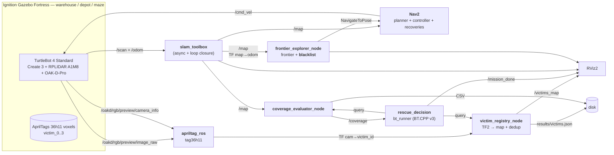

# Autonomous Search and Rescue — Project B (IA712)

> Autonomous mobile robot exploring a simulated disaster area in Ignition Gazebo, mapping the environment (SLAM with loop closure), and locating "victims" (AprilTags) **without human intervention**.

[](https://docs.ros.org/en/humble/)
[](https://releases.ubuntu.com/22.04/)
[](LICENSE)

[Version française](README.fr.md)

---

## Table of contents

1. [Team](#team-ensta--télécom-paris--ia712)
2. [Problem statement](#problem-statement)
3. [System architecture](#system-architecture)
4. [Building blocks](#building-blocks)
5. [Repository layout](#repository-layout)
6. [Prerequisites & installation](#prerequisites--installation)
7. [Build & launch](#build--launch)
8. [Decision journey](#decision-journey--how-bl-got-here)
9. [Progress](#progress-6-session-plan)
10. [Risks & mitigations](#risks--mitigations)
11. [Bonus strategy](#bonus-strategy)
12. [Success criteria](#success-criteria-self-check-before-l18)
13. [References](#references)

---

## Team (ENSTA / Télécom Paris — IA712)

| Name           | Email                              | Role          |
| -------------- | ---------------------------------- | ------------- |
| Julien GIMENEZ | julien.gimenez@telecom-paris.fr    | _TBD_         |
| Hugo FANCHINI  | hugo.fanchini@telecom-paris.fr     | _TBD_         |
| Paul CINTRA    | paul.cintra@telecom-paris.fr       | _TBD_         |
| Yimou ZHANG    | yimou.zhang@telecom-paris.fr       | _TBD_         |

---

## Problem statement

**Module:** IA712 — Mobile Robotics (Prof. Zhi Yan, ENSTA - Institut Polytechnique de Paris)
**Topic B:** *Autonomous Search and Rescue*.

> *"In a simulated disaster zone, a robot must autonomously explore an unknown environment, locate 'victims' (represented by AprilTags or specific colored cylinders), and report their precise coordinates."* — official assignment

### Objectives (from the assignment + lecture)

1. **Autonomous exploration** without teleoperation — frontier-based (expected baseline) or RRT.
2. **SLAM** with loop closure (`slam_toolbox`) — target coverage **≥ 90 %**.
3. **Victim detection** via **AprilTags** (or ArUco / QR / colored blobs) — *"you will NOT do sophisticated YOLO-based human detection"* (Prof. Yan).
4. **TF projection**: *"project their positions from the camera frame to the global frame using TF2"*.
5. **Behavior Tree** mandatory (FSM not allowed — common constraint across the 4 topics).
6. **One-click launch**: a single bringup launches everything.
7. **Bonus**: quantitative comparison of *frontier-greedy* vs *information-gain*.

### Common constraints (assignment)

| Constraint         | Value                                                       |
| ------------------ | ----------------------------------------------------------- |
| Software           | ROS 2 + Gazebo                                              |
| Decision making    | Behavior Trees (no FSM)                                     |
| One-click          | a single bringup launches everything                        |
| Versioning         | GitHub                                                      |
| Final demo         | session L18 — 10 min presentation + 10 min Q&A              |
| Report             | ≤ 10 pages PDF — team, architecture (detailed diagram), lessons learned |
| Report deadline    | **June 21st**                                               |

---

## System architecture

The project is split into **four ROS 2 packages**: `rescue_bringup` (launch + configs), `rescue_robot` (the Python "megapackage": exploration, perception, results, mocks), `rescue_world` (Ignition worlds + AprilTag targets), and `rescue_decision` (the BehaviorTree.CPP supervisor).



### Key flows

1. **SLAM** continuously publishes `/map` and the `map → odom` TF.
2. **`frontier_explorer_node`** reads `/map`, picks the best frontier, and sends it to Nav2 via `nav2_msgs/action/NavigateToPose`. Unreachable frontiers are **blacklisted** (see below) so the robot never loops forever on a dead one.
3. **`apriltag_ros`** publishes a `camera → victim_<id>` TF for each tag in view.
4. **`victim_registry_node`** projects each detection from the camera frame to `map` via TF2, deduplicates by tag ID, and persists `results/victims.json`.
5. **`coverage_evaluator_node`** publishes `/coverage` from the occupancy grid.
6. **`bt_runner`** (BehaviorTree.CPP v3) supervises the mission: it waits for `/map`, checks `/coverage ≥ 0.90`, surfaces the live victim count, and latches `/mission_done`.
7. **Stop criterion:** coverage ≥ 90 % (in run, ~90 % coverage reached) **OR** no more reachable frontiers.

---

## Building blocks

Each block corresponds to a ROS 2 package (see [§ Repository layout](#repository-layout)).

### [`rescue_world`](ros2_ws/src/rescue_world/) — Ignition worlds + AprilTag targets

- **Worlds:** we use the Ignition Fortress worlds shipped by `turtlebot4_ignition_bringup` (`warehouse`, `depot`, `maze`); a custom `rescue_arena.sdf` and a legacy `disaster_world.world` are also provided.
- **AprilTags:** **tag36h11** family, IDs 0-3 (4 victims), side length **16 cm**, placed on walls at OAK-D camera height. Rendered as **colored-box voxels** (not PBR textures, which Ogre2+Mesa render as blank white) — see [`generate_apriltag_models.py`](scripts/generate_apriltag_models.py) and `ERRORS_AND_FIXES.md` #29.
- **Legacy fallback:** TurtleBot 3 Waffle Pi worlds under Gazebo Classic 11, kept for hosts where Ignition rendering is unstable.

### [`rescue_robot`](ros2_ws/src/rescue_robot/) — Exploration, perception, results (Python megapackage)

This single Python package hosts the autonomy nodes, grouped by submodule (`exploration/`, `detection/`, `results/`, `bt/`, `mocks/`).

#### Autonomous exploration with frontier blacklist (distinctive feature)

- **`frontier_explorer_node`** + **`frontier_search.py`** — frontier detection (free cells adjacent to unknown, CM8), BFS 8-connectivity clustering, and a `NavigateToPose` action client (Yamauchi 1997, CM8 §6-14). Autonomous exploration is **validated in run (~90 % coverage reached)**.
- **Inaccessible-frontier blacklist (CM8 "Inaccessible Frontiers"):** a frontier whose navigation Nav2 aborts (status `ABORTED`), or that gets re-selected with no coverage progress, is **blacklisted and never re-selected**. The blacklist key is a **quantized world coordinate**, so it stays stable as the map grows. This is what prevents the robot from looping forever on a dead frontier. Parameters in [`config/explorer_params.yaml`](ros2_ws/src/rescue_robot/config/explorer_params.yaml):
  - `blacklist_quantum_m` — world-metre bucket size used to key blacklisted frontiers.
  - `stall_repeats` — a re-selected frontier with flat coverage for this many ticks is blacklisted.
  - `coverage_epsilon` — minimum coverage delta counted as progress.
  - `max_blacklist_clears` — how many times the whole blacklist may be cleared (a frontier can become reachable later).

#### Victim registry (AprilTag → map)

- **Detector:** [`apriltag_ros`](https://github.com/christianrauch/apriltag_ros) (apt), **tag36h11**, on the OAK-D stream `/oakd/rgb/preview/image_raw`. Tag config: [`apriltag_tags.yaml`](ros2_ws/src/rescue_bringup/config/apriltag_tags.yaml) (IDs 0-3 → frames `victim_0..3`, size 0.16 m, `decimate: 1.0`). No manual calibration: the simulated OAK-D publishes its intrinsics on `/oakd/rgb/preview/camera_info`.
- **`victim_registry_node`** (Python): for each detection it looks up `camera → victim_<id> → map` via TF2, **deduplicates by tag ID**, publishes `/victims_map` markers for RViz, and **persists `results/victims.json`** after every new registration.

#### Coverage metrics

- **`coverage_evaluator_node`** subscribes to `/map`, computes `coverage = (free + occupied) / (free + occupied + unknown)`, and publishes `/coverage` (the BT's stop signal) plus a CSV for the bonus benchmark.

#### Mocks (dev without Gazebo)

- `mock_map_publisher`, `mock_coverage_publisher`, `mock_victim_publisher` let everyone test the BT, the registry and RViz **without launching Ignition / Nav2 / SLAM** (`mock_system.launch.py`).

### [SLAM via `slam_toolbox`](https://github.com/SteveMacenski/slam_toolbox) (wired in bringup)

- **Mode:** `online_async` (Nav2-friendly), launched through `turtlebot4_navigation/slam.launch.py`.
- **Output:** `/map` (OccupancyGrid) + `map → odom` TF.
- **Loop-closure tuning** ([`slam_params_tb4.yaml`](ros2_ws/src/rescue_robot/config/slam_params_tb4.yaml)): `loop_match_minimum_chain_size: 10`, `scan_buffer_size: 10`, conservative travel thresholds.

### [`rescue_decision`](ros2_ws/src/rescue_decision/) — Global Behavior Tree (BehaviorTree.CPP v3)

- **Engine:** a **real** `BehaviorTree.CPP v3` runner ([`src/bt_runner.cpp`](ros2_ws/src/rescue_decision/src/bt_runner.cpp)), visualizable in **Groot** (ZMQ Monitor on **port 1666**), tree XML in [`bt_xml/mission.xml`](ros2_ws/src/rescue_decision/bt_xml/mission.xml). Validated with mocks.
- **Tree shape:** a `ReactiveSequence` ticked once per runner cycle (the runner spins the ROS executor between ticks so `/map` and `/coverage` stay fresh):

```xml
<root main_tree_to_execute="Mission">
  <BehaviorTree ID="Mission">
    <ReactiveSequence name="search_and_rescue_mission">
      <WaitForMap name="wait_for_slam_map"/>
      <CoverageReached name="coverage_90" threshold="0.90"/>
      <VictimsFound name="report_victims" min_count="0"/>
      <PublishMissionDone name="finalize"/>
    </ReactiveSequence>
  </BehaviorTree>
</root>
```

- **Custom BT nodes:** `WaitForMap`, `CoverageReached` (reads `/coverage`), `VictimsFound` (surfaces the live victim count), `PublishMissionDone` (latches `/mission_done`).

### [`rescue_bringup`](ros2_ws/src/rescue_bringup/) — Launch & configs

- **Primary bringup (TB4 / Ignition Fortress):** [`bringup_tb4.launch.py`](ros2_ws/src/rescue_bringup/launch/bringup_tb4.launch.py) starts a **single** Ignition instance + Create 3 + RPLIDAR + OAK-D + SLAM + Nav2 + `apriltag_ros` (on the OAK-D stream) + RViz (`project_view.rviz`, Frame Rate clamped to 10 for perf).
- **Legacy fallback:** `bringup.launch.py` brings up the TurtleBot 3 Waffle Pi + Gazebo Classic 11 stack.
- **Validated end-to-end demo:** `./scripts/run.sh demo-tb4` chains the full stack and, in step 7b, the perception (`victim_registry`) and Behavior Tree (`bt_runner`) supervision.
- **Isolation toggles** (`headless`, `world`, `model`, `launch_rviz`) and env switches let you enable/disable each brick without restarting the simulator.

---

## Repository layout

```
autonomous-search-and-rescue/
├── README.md / README.fr.md       # this document
├── LICENSE
├── pyproject.toml / .python-version  # uv dev environment (Python 3.10)
├── docs/                          # project documentation
├── scripts/                       # orchestration scripts
│   ├── run.sh                     # entry point: ./scripts/run.sh <command>
│   ├── sh/                        # one small executable per module
│   ├── generate_rescue_arena.py   # world generator
│   └── plot_coverage.py           # benchmark plots
├── tests/                         # 9 pytest files (uv-driven)
└── ros2_ws/                       # colcon workspace
    └── src/
        ├── rescue_bringup/        # bringup_tb4 / bringup launch + Nav2/SLAM/AprilTag configs + rviz
        ├── rescue_robot/          # exploration (frontier + blacklist), perception, results, mocks (Python)
        │   └── rescue_robot/      # exploration/ detection/ results/ bt/ mocks/ utils/
        ├── rescue_world/          # Ignition worlds + AprilTag models
        └── rescue_decision/       # bt_runner.cpp + mission.xml (BehaviorTree.CPP v3)
```

Naming convention: **`rescue_*`** prefix to isolate our packages from vendor dependencies.

---

## Prerequisites & installation

### System

- **Ubuntu 22.04** (Jammy) — native or WSL 2.
- **WSL 2 (Windows)?** Read [`docs/running_on_wsl.md`](docs/running_on_wsl.md) first — GPU acceleration (don't force software GL), the `.wslconfig` that stops long runs from rebooting the host, and the mandatory `ros-humble-rmw-cyclonedds-cpp`.
- **ROS 2 Humble** installed (`source /opt/ros/humble/setup.bash`).
- **Python 3.10** (pinned via `.python-version`), matching Ubuntu 22.04 / ROS 2 Humble.

> **If you use Conda**: deactivate the environment (`conda deactivate`) before `colcon build`, otherwise `rosidl` / `ament_cmake` will use Conda's Python and the build breaks.

### ROS packages (TurtleBot 4 + Ignition Gazebo Fortress)

```bash
sudo apt update && sudo apt install -y \
  ros-humble-turtlebot4-simulator \
  ros-humble-turtlebot4-ignition-bringup \
  ros-humble-turtlebot4-navigation \
  ros-humble-turtlebot4-msgs \
  ros-humble-irobot-create-msgs \
  ros-humble-ros-gz-bridge \
  ros-humble-nav2-bringup \
  ros-humble-nav2-behavior-tree \
  ros-humble-slam-toolbox \
  ros-humble-apriltag-ros \
  ros-humble-apriltag-msgs \
  ros-humble-rmw-cyclonedds-cpp \
  ros-humble-rviz2 \
  ros-humble-tf2-tools \
  ros-humble-behaviortree-cpp-v3 \
  ignition-fortress \
  python3-opencv \
  python3-numpy \
  python3-colcon-common-extensions
```

> **WSL 2 users — `ros-humble-rmw-cyclonedds-cpp` is required, not optional.** Fast-RTPS
> discovery is flaky on WSL (the in-Ignition controllers never load, `/turtlebot4/odom`
> stays silent), so the `win` platform profile selects **CycloneDDS**. Without the package
> every node dies at startup with *"RMW implementation not installed (rmw_cyclonedds_cpp)"*
> (see [`docs/ERRORS_AND_FIXES.md`](docs/ERRORS_AND_FIXES.md) #32). `python3-opencv` + `python3-numpy`
> are needed by [`scripts/generate_apriltag_models.py`](scripts/generate_apriltag_models.py)
> to build the voxel AprilTag models.

> A convenience installer is also provided: `./scripts/run.sh install-apt`.

### Robot / simulation stack

- **Primary (default):** **TurtleBot 4 Standard** (Create 3 + RPLIDAR A1M8 + OAK-D-Pro) under **Ignition Gazebo Fortress** (worlds `warehouse`, `depot`, `maze`).
- **Fallback (legacy, kept):** **TurtleBot 3 Waffle Pi** + **Gazebo Classic 11**, useful where Ignition rendering is unstable.

### Python dev environment (uv)

The ROS 2 runtime is kept separate from the Python dev venv. Use `uv` for the lightweight tests, result scripts and linting:

```bash
./scripts/run.sh uv-sync
./scripts/run.sh uv-test
./scripts/run.sh uv-lint
```

Do **not** install ROS 2 packages such as `rclpy` through uv/pip — they come from the ROS 2 Humble installation.

---

## Build & launch

### Build

```bash
source /opt/ros/humble/setup.bash   # deactivate conda first if you use it
./scripts/run.sh build
```

### Launch (TurtleBot 4 / Ignition Fortress stack)

```bash
# Validated end-to-end demo: full TB4 stack + exploration + perception + BT
./scripts/run.sh demo-tb4

# OR the plain TB4 bringup (sim + SLAM + Nav2 + AprilTag + RViz), drive it yourself
ros2 launch rescue_bringup bringup_tb4.launch.py

# OR the legacy TB3 / Gazebo Classic fallback
ros2 launch rescue_bringup bringup.launch.py
```

`bringup_tb4.launch.py` arguments:

| Argument       | Values                            | Description                                                |
| -------------- | --------------------------------- | ---------------------------------------------------------- |
| `use_sim_time` | `true` \| `false`                 | Use the Ignition `/clock` for all nodes                    |
| `headless`     | `true` \| `false`                 | Run Ignition without GUI (CI / benchmark)                  |
| `world`        | `warehouse` \| `depot` \| `maze`  | Ignition world (default `warehouse`)                       |
| `model`        | `standard` \| `lite`              | TurtleBot 4 variant (`standard` ships the OAK-D)           |
| `launch_rviz`  | `true` \| `false`                 | Launch RViz2 with `project_view.rviz` (Frame Rate=10)      |

### Demo environment switches (`./scripts/run.sh demo-tb4`)

| Variable                | Default | Effect                                                        |
| ----------------------- | :-----: | ------------------------------------------------------------- |
| `IA712_EXPLORE`         | `0`     | `1` = robot explores autonomously (`frontier_explorer_node`)  |
| `IA712_BT`              | `1`     | `0` = disable the Behavior Tree supervisor (`bt_runner`)      |
| `IA712_VICTIM_REGISTRY` | `1`     | `0` = disable the victim registry                             |
| `IA712_TB4_GUI`         | `1`     | `0` = headless Ignition (no Gazebo window, CI / low RAM)      |
| `IA712_RVIZ`            | `1`     | `0` = fully headless run (no RViz)                            |
| `IA712_TB4_WORLD`       | `maze`  | Ignition world; use `rescue_arena` for the victim world      |
| `IA712_EXPLORE_STRATEGY`| `info_gain` | exploration strategy: `greedy` \| `info_gain` \| `size_dist` (L17) |
| `IA712_SPAWN_X/Y/YAW`   | `0/0/0` | spawn the robot at a chosen pose (e.g. facing a victim)       |
| `IA712_RESULTS_DIR`     | `results` | where `result_exporter` writes (the benchmark points each run here) |
| `IA712_WSL_SOFTWARE_GL` | `0`     | `1` = force software GL fallback (only if the GPU path fails) |

### L17 — exploration benchmark (greedy vs information-gain)

```bash
# real comparison runs (2 strategies × N runs, headless) → experiments/<algo>_run<n>/
env -i HOME="$HOME" PATH=/usr/bin:/bin TERM=xterm DISPLAY=:0 \
  IA712_BENCH_RUNS=3 IA712_BENCH_DURATION=600 \
  bash scripts/sh/run_benchmark.sh

# build the plots + summary table from whatever runs exist
python3 scripts/plot_benchmark.py experiments
# → experiments/plots/coverage_over_time.png, summary_bars.png, experiments/summary.md
```

See [`docs/exploration_benchmark.md`](docs/exploration_benchmark.md) for the metrics and hypothesis.

### Full command reference (`./scripts/run.sh <cmd>`)

| Group | Commands |
|---|---|
| **Setup** | `install-apt` · `build` · `clean` · `doctor-env` |
| **Run (TB4)** | `demo-tb4` *(the main demo)* · `simulation-tb4` · `teleop-tb4` · `check-tb4` |
| **Run (TB3 legacy)** | `demo` · `simulation` · `simulation-house[-safe]` · `simulation-base` · `simulation-empty` · `teleop` · `check-tb3` |
| **Modules** | `bringup` · `navigation` · `exploration` · `detection` · `results` · `bt` · `waypoint` · `rviz` |
| **Dev / test** | `mock` *(no Gazebo)* · `uv-sync` · `uv-test` · `uv-lint` · `camera-check` |
| **Cleanup** | `kill-sim` *(kill leftover sim/ROS + clear stale DDS SHM)* |

Standalone scripts (from the repo root of the workspace): `scripts/sh/run_benchmark.sh`,
`scripts/plot_benchmark.py`, `scripts/plot_coverage.py`, `scripts/annotate_map.py`,
`scripts/generate_run_summary.py`, `scripts/generate_apriltag_models.py`,
`scripts/generate_rescue_arena.py`.

### Run convention & environment

- **Edit in `bl/`, run in `run/bl/`**: sources live here; build & run from a synced copy under `run/` (`rsyncDown_bl_run.sh` from the repo root).
- **Conda-free**: `conda deactivate` (or `env -i …`) before `colcon build` / running nodes (ERRORS #31).
- **Windows/WSL 2**: read [`docs/running_on_wsl.md`](docs/running_on_wsl.md) for GPU acceleration + the `.wslconfig` that keeps long runs stable.

---

## Decision journey — how `bl` got here

This section is the **pedagogical record of the key decisions** behind `bl`, in
`Problem → Decision → Why` form. It is the "lessons learned" backbone for the
report. Each technical pitfall is detailed in [`docs/ERRORS_AND_FIXES.md`](docs/ERRORS_AND_FIXES.md).

### L13–L14 — Foundations
- **4 ROS 2 packages** (`rescue_bringup` / `rescue_robot` / `rescue_world` / `rescue_decision`). *Why:* clear separation (launch vs autonomy vs worlds vs decision) so the team works in parallel.
- **Mock system** (`mock_map/coverage/victim` publishers). *Why:* develop & unit-test the BT, results and visualization **without Gazebo** (fast, CI-friendly) before the real stack exists.

### L15 — SLAM + autonomous exploration
- **Frontier exploration** (Yamauchi) + `slam_toolbox` async with loop closure, target ≥ 90 % coverage. *Why:* the assignment baseline.
- **Inaccessible-frontier blacklist (CM8).** *Problem:* the robot loops forever on a frontier Nav2 can't reach (observed stuck at 53.8 %). *Decision:* blacklist a frontier when Nav2 aborts it **or** it's re-selected with no coverage gain; **key it by world-quantised coordinate**, not grid cell. *Why world coords:* the grid origin shifts as SLAM grows the map, so a grid-cell key would drift and a blacklisted frontier would silently come back.

### L16 — Decision (BT) + perception
- **BehaviorTree.CPP v3, not an FSM.** *Why:* the assignment forbids FSMs. Used a **ReactiveSequence**, not `RetryUntilSuccessful` (which busy-loops with `num_attempts=-1`, ERRORS #28).
- **AprilTag `tag36h11`, not YOLO.** *Why:* the assignment explicitly excludes sophisticated human detection.
- **Voxel AprilTags, not PBR textures.** *Problem:* a PBR `albedo_map` renders as a blank **white** panel under Ogre2+Mesa (WSL *and* cluster) → `apriltag_ros` sees nothing. *Decision:* build each tag from **100 colored boxes** + a **white quiet-zone ring** around the native **8×8** marker. *Why the ring/8×8:* a naive 10×10 resize distorts the code and drops the quiet zone → the tag *renders* but is **undetectable**; the ring + correct cell count fix detection (ERRORS #29).
- **Single source of truth for victim placement.** *Problem:* two generators fought over `rescue_arena.sdf` (cylinders, then regex-patched into AprilTags). *Decision:* `generate_rescue_arena.py` owns the world (emits the AprilTag `<include>`s); `generate_apriltag_models.py` only builds the tag **model assets**.
- **`decimate: 1.0`.** *Why:* a 16 cm tag is small in the OAK-D preview; `decimate>1` sub-samples it below the detectable size.
- **Victim registry via TF2.** Each detection is projected `camera → victim_<id> → map`, de-duplicated by ID, and persisted to `results/victims.json` — the assignment's "project to the global frame" requirement.

### Cross-cutting — environment & infrastructure
- **CycloneDDS on WSL (required).** *Problem:* Fast-RTPS discovery is flaky on WSL → in-Ignition controllers never load, `/turtlebot4/odom` stays silent. *Decision:* the `win` profile selects CycloneDDS on loopback, **guarded** (fall back to Fast-RTPS if the package is absent, ERRORS #32).
- **GPU rendering (D3D12) — never force software GL.** *Problem:* `llvmpipe` software rendering is ~**23× slower** and saturates the CPU → the host reboots on long runs. *Decision:* the `win` profile renders Ogre2 on the **WSLg D3D12 GPU** (GL 4.5 override + NVIDIA adapter). *Note:* WSL has **no native NVIDIA Linux GL/Vulkan** (CUDA + D3D12 only; CUDA ≠ rendering), ERRORS #33.
- **`.wslconfig` (cap CPU + swap).** *Problem:* very long runs still reboot the host. *Decision:* cap WSL CPU/memory + add swap to leave Windows headroom — see [`docs/running_on_wsl.md`](docs/running_on_wsl.md).
- **Conda-free build/run.** *Problem:* conda's Python 3.13 breaks the build (`catkin_pkg`, ncurses link) **and** runtime (`rclpy`/numpy). *Decision:* build/run in `env -i …` or `conda config --set auto_activate_base false` (ERRORS #31).
- **Source in `bl/`, execute in `run/bl/`.** *Why:* keep the published source clean; build & run from a synced copy (`rsyncDown_bl_run.sh`).
- **Cloud externalization abandoned.** *Problem:* the mesogip cluster bans GPU jobs that don't actually use the GPU (our render is software), and gpu-gw has no container/ROS. *Decision:* run **locally** (GPU + `.wslconfig`). Full write-up: `cloud_technique_2xcloud_robotique_ros.md`.

### L17 — Bonus (exploration strategies)
- **Greedy vs information-gain.** IG = argmax `gain(f) − λ·cost(f)` (Stachniss et al., ICRA 2005). See [`docs/exploration_benchmark.md`](docs/exploration_benchmark.md).
- **SpinAndScan.** *Problem:* frontier goals point the camera along travel, so the OAK-D rarely faces the wall tags (explores but finds no victim). *Decision:* rotate in place after each reached goal to sweep the camera across the walls.
- **Goal refinement.** *Problem:* a raw centroid sits on the explored/unknown boundary → Nav2 rejects it. *Decision:* snap the goal to the nearest **free** cell (`nearest_free_cell`) + skip near-zero-gain frontiers (`info_gain_min_gain`).

### L18 — what remains
Chaining all 4 victims in **one continuous autonomous run** + reliably reaching 90 % needs deeper **Nav2 point-to-point tuning** (reachability pre-check via `ComputePathToPose`, costmap/controller tuning). Each capability is individually validated; the integration polish is the last step.

---

## Progress (6-session plan)

| Session | Status | End-of-session deliverable                                                                              |
| ------- | :----: | ------------------------------------------------------------------------------------------------------- |
| L13     |  Done  | Team formed, Project B selected, repo created                                                            |
| L14     |  Done  | Architecture defined, `rescue_*` packages scaffolded, `colcon build` passes                              |
| L15     |  Done  | SLAM (`slam_toolbox`) + autonomous frontier exploration (`frontier_explorer_node` + `frontier_search.py`, with **inaccessible-frontier blacklist** — CM8) + Nav2 + AprilTag config wired; **autonomous exploration validated in run (~90 % coverage reached)** |
| L16     |  Done  | **BT**: `rescue_decision/bt_runner.cpp` = real BehaviorTree.CPP v3 (ReactiveSequence in `bt_xml/mission.xml`, Groot Monitor on ZMQ port 1666), validated with mocks. **Perception**: `victim_registry_node` projects AprilTag detections to `map` via TF2 (dedup by ID, persists `results/victims.json`); **4 tag36h11 voxel AprilTag models** (`victim_0..3`, via `scripts/generate_apriltag_models.py` — colored boxes + white quiet-zone, Ogre2/Mesa-safe) placed statically in `rescue_arena.sdf`, `apriltag_ros` (`decimate 1.0`) + `camera_info` bridge wired. **Nav2 recovery re-enabled** (spin/backup → a wedged robot frees itself). All integrated in `run_demo_tb4.sh` (steps 7b/8). **Validated end-to-end on the real robot** (headless, GPU): all **4 victims** (`id 0..3`) detected by the TB4 OAK-D → `apriltag_ros` → `victim_registry` → `results/victims.json` (one per spawn-facing run); **autonomous frontier exploration reaches 91 % coverage and finds a victim on its own**. GPU rendering (D3D12, ~23× faster) + `.wslconfig` keep long runs stable — see [`docs/running_on_wsl.md`](docs/running_on_wsl.md), `ERRORS_AND_FIXES.md` #29/#32/#33. _Chaining all 4 victims in one continuous autonomous patrol needs deeper Nav2 point-to-point tuning — demo polish, tracked toward L18._ |
| L17     | Code done | **Bonus implemented** — `greedy` vs `info_gain` exploration, selectable via the `strategy` param / `IA712_EXPLORE_STRATEGY`. Info-gain = argmax `gain(f)−λ·cost(f)` (`frontier_search.choose_frontier_infogain`, gain = unknown cells in radius). **SpinAndScan** rotates after each reached goal so the camera sweeps the walls (victims found *during* exploration). `result_exporter` logs `time_to_50/75/90`, path length & victims per run; `scripts/sh/run_benchmark.sh` (2 algos × N runs) + `scripts/plot_benchmark.py` → `experiments/plots/` + `summary.md`. See [`docs/exploration_benchmark.md`](docs/exploration_benchmark.md). _Benchmark runs to be executed + plotted for the report._ |
| L18     |  TODO  | Live demo (10 min) + report delivered (≤ 10 pages, PDF)                                                  |

This branch is the most advanced of the team: **L16 Done**.

---

## Risks & mitigations

| Risk                                              | Probability | Impact   | Mitigation                                                          |
| ------------------------------------------------- | :---------: | :------: | ------------------------------------------------------------------- |
| Robot loops forever on an unreachable frontier    | Medium      | High     | **Frontier blacklist** (quantized key, `ABORTED`/stall detection) — implemented |
| Loop closure mistuned, map drifts on long runs    | Medium      | High     | Early tuning of `slam_params_tb4.yaml` + serialized graph for debug |
| AprilTag poorly detected (Ignition lighting)      | Low         | Medium   | tag36h11 16 cm at camera height; fallback to colored cylinders + HSV |
| BT too complex, long debug                        | Medium      | Medium   | Minimal `ReactiveSequence`, Groot Monitor for debug, mock-driven tests |
| WSL2 / ARM64 + Gazebo GUI unstable                | Medium      | Medium   | `IA712_TB4_GUI=0` headless validated + auto platform profiles + TB3 legacy fallback |
| Conda interferes with `colcon` (seen on this host) | High       | Low      | `conda deactivate` before build; documented here                    |
| Absent member, uneven workload                    | —           | —        | Module ownership + mocks let everyone work independently            |

---

## Bonus strategy

**Hypothesis to test:** *information-gain exploration reduces the time to reach 90 % coverage by > 15 % vs. frontier-greedy, at the cost of higher path length.*

**Experimental plan:**
- 2 algorithms × 3 runs × 1 world = **6 runs**.
- Fixed seed; identical starting position.
- Metrics (CSV, via `coverage_evaluator_node`): `time_to_50% / 75% / 90% / max coverage`, `total path length`, `# victims discovered`, `# loop closures`.
- Report output: 2 plots (coverage(t), summary bar-chart, via `scripts/plot_coverage.py`) + summary table.

**Why it's accessible:** info-gain only reuses the frontiers already detected by `frontier_search.py` + one call to the Nav2 `compute_path_to_pose` service. No new global algorithm.

---

## Success criteria (self-check before L18)

- [ ] `./scripts/run.sh demo-tb4` launches everything in one command, no crash, on a fresh machine.
- [ ] Coverage ≥ 90 % of the reference world in nominal run (~90 % reached so far).
- [ ] All victims (≥ 3) detected, projected to `map`, and published as RViz markers (±10 cm).
- [ ] Loop closure visible in `slam_toolbox` on at least one run.
- [ ] BT visualizable in Groot (ZMQ port 1666), XML versioned in [`ros2_ws/src/rescue_decision/bt_xml/`](ros2_ws/src/rescue_decision/bt_xml/).
- [ ] Bonus plots present (frontier-greedy vs information-gain).
- [ ] Report ≤ 10 pages (sections: team / architecture / lessons learned / results / bonus).
- [ ] Backup demo video recorded.
- [ ] Presentation slides ready (~6-8 slides for 10 min).

---

## References

### IA712 lectures (Prof. Zhi Yan)

| Lecture | Topic directly reused                                            |
| ------- | ---------------------------------------------------------------- |
| CM6     | Perception (camera sensors, detection)                           |
| CM7     | SLAM (Occupancy Grid, loop closure)                              |
| **CM8** | **Exploration (Frontier-based + Information-Gain, Inaccessible Frontiers) — central** |
| CM9     | Planning                                                         |
| CM10    | Navigation (Nav2, costmaps)                                      |

### External packages

- [`apriltag_ros`](https://github.com/christianrauch/apriltag_ros) — AprilTag detector for ROS 2 (apt)
- [`slam_toolbox`](https://github.com/SteveMacenski/slam_toolbox) — 2D SLAM with loop closure
- [Nav2 docs](https://docs.nav2.org/) — navigation stack
- [BehaviorTree.CPP](https://www.behaviortree.dev/) — BT engine
- [Groot](https://www.behaviortree.dev/groot/) — visual BT editor / monitor

### Literature

- Yamauchi, B. (1997). *A frontier-based approach for autonomous exploration*. CIRA.
- Stachniss, C., Grisetti, G., Burgard, W. (2005). *Information Gain-based Exploration Using Rao-Blackwellized Particle Filters*. RSS.

### License

MIT — see [LICENSE](LICENSE).
