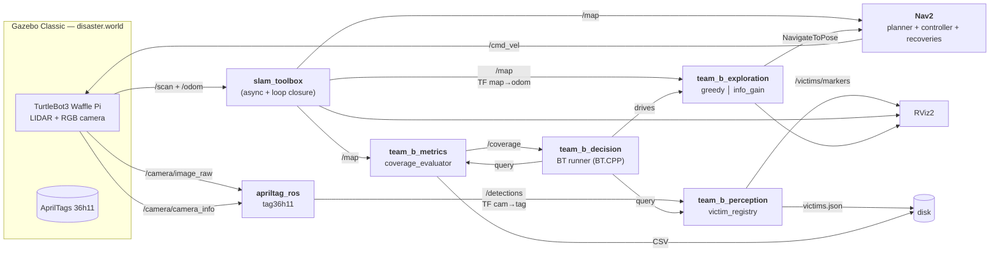

# Autonomous Search and Rescue — Project B (IA712)

> Autonomous mobile robot exploring a simulated disaster area in Gazebo, mapping the environment (SLAM with loop closure), and locating "victims" (AprilTags) **without human intervention**.

[](https://docs.ros.org/en/humble/)
[](https://releases.ubuntu.com/22.04/)
[](LICENSE)

[Version française](README.fr.md)

---

## Table of contents

1. [Team](#team-ensta--télécom-paris--ia712)
2. [Problem statement](#problem-statement)
3. [System architecture](#system-architecture)
4. [Building blocks](#building-blocks)
5. [Repository layout](#repository-layout)
6. [Prerequisites & installation](#prerequisites--installation)
7. [Build & launch](#build--launch)
8. [Progress](#progress-6-session-plan)
9. [Risks & mitigations](#risks--mitigations)
10. [Bonus strategy](#bonus-strategy)
11. [Success criteria](#success-criteria-self-check-before-l18)
12. [References](#references)

---

## Team (ENSTA / Télécom Paris — IA712)

| Name           | Email                              | Role (see [docs/team.md](docs/team.md)) |
| -------------- | ---------------------------------- | --------------------------------------- |
| Julien GIMENEZ | julien.gimenez@telecom-paris.fr    | _TBD_                                   |
| Hugo FANCHINI  | hugo.fanchini@telecom-paris.fr     | _TBD_                                   |
| Paul CINTRA    | paul.cintra@telecom-paris.fr       | _TBD_                                   |
| Yimou ZHANG    | yimou.zhang@telecom-paris.fr       | _TBD_                                   |

---

## Problem statement

**Module:** IA712 — Mobile Robotics (Prof. Zhi Yan, ENSTA - Institut Polytechnique de Paris)
**Topic B:** *Autonomous Search and Rescue*.

> *"In a simulated disaster zone, a robot must autonomously explore an unknown environment, locate 'victims' (represented by AprilTags or specific colored cylinders), and report their precise coordinates."* — official assignment

### Objectives (from the HTML assignment + lecture)

1. **Autonomous exploration** without human intervention — frontier-based (expected baseline) or RRT.
2. **SLAM** with loop closure (`slam_toolbox`) — target coverage **≥ 90 %**.
3. **Victim detection** via **AprilTags** (or ArUco / QR / colored blobs) — *"you will NOT do sophisticated YOLO-based human detection"* (Prof. Yan).
4. **TF projection**: *"project their positions from the camera frame to the global frame using TF2"*.
5. **Behavior Tree** mandatory (FSM not allowed — common constraint across the 4 topics).
6. **One-click launch**: `ros2 launch team_b_bringup bringup.launch.py`.
7. **Bonus**: quantitative comparison of *frontier-greedy* vs *information-gain*.

### Common constraints (HTML assignment)

| Constraint         | Value                                                       |
| ------------------ | ----------------------------------------------------------- |
| Software           | ROS 2 + Gazebo                                              |
| Decision making    | Behavior Trees (no FSM)                                     |
| One-click          | a single `bringup.launch.py` launches everything            |
| Versioning         | GitHub                                                      |
| Final demo         | session L18 — 10 min presentation + 10 min Q&A              |
| Report             | ≤ 10 pages PDF — team, architecture (detailed diagram), lessons learned |
| Report deadline    | **June 21st**                                               |

### Explicit recommendation from Prof. Yan

> *"download the packages from GitHub, which is of course open source. Then, put them in your ROS workspace, build them, and run them as a node."*

→ Our [`ros2_ws/team_b.repos`](ros2_ws/team_b.repos) file lists external packages to vendor (`m-explore-ros2`, `apriltag_ros`, etc.); `vcs import` clones them into `src/third_party/` at build time.

---

## System architecture



Full diagram + complete TF tree: [docs/architecture.md](docs/architecture.md).

### Key flows

1. **SLAM** continuously publishes `/map` and the `map → odom` TF.
2. **The explorer** (frontier-greedy or info-gain) reads `/map`, picks a goal, and sends it to Nav2 via `nav2_msgs/action/NavigateToPose`.
3. **`apriltag_ros`** publishes a `camera_link → tag_<id>` TF + a `/detections` message.
4. **`victim_registry_node`** composes `map → camera_link → tag_<id>` via `tf2_ros::Buffer::lookupTransform()` and registers the victim (if new).
5. **The global BT** synchronizes everything: pauses exploration on detection → logs → resumes.
6. **Stop criteria:** coverage ≥ 90 % **OR** no more frontiers **OR** all expected victims found.

---

## Building blocks

Each block corresponds to a ROS 2 package `team_b_*` (see [§ Repository layout](#repository-layout)).

### [`team_b_world`](ros2_ws/src/team_b_world/) — Gazebo world + AprilTag targets

- **Decision:** custom "disaster" world (~50 m²) with 3-5 rooms, 1 corridor, **topological loops** to stress loop closure.
- **AprilTags:** **tag36h11** family, 16 × 16 cm, placed on walls at camera height (~10 cm above ground).
- **Plan A:** edit with the mouse in Gazebo Classic then "Save as world".
- **Plan B (fallback):** reuse `turtlebot3_world` or `turtlebot3_house` from the `turtlebot3_gazebo` package, and add AprilTags.
- **AprilTag textures:** generated via `apriltag-generation` (Python) or via SDF models from [pal-robotics/aruco_ros](https://github.com/pal-robotics/aruco_ros).

### [`team_b_exploration`](ros2_ws/src/team_b_exploration/) — Autonomous exploration

#### Baseline — Frontier-greedy (Yamauchi 1997, see CM8 §6-14)

- **External candidate:** [`m-explore-ros2`](https://github.com/robo-friends/m-explore-ros2) (`humble` branch).
- **Plan B (if package broken):** Python reimplementation (~300 lines):
  1. Subscribe to `/map`.
  2. Detect frontiers (cells `free` adjacent to `unknown`, see CM8 §9).
  3. BFS 8-connectivity clustering (see CM8 §10).
  4. Send the closest large cluster's centroid to the `NavigateToPose` action client.
- **Heuristic:** select the closest frontier (`Utility(f) = -Cost(robot, f)`, see CM8 §12).

#### Bonus variant — Information-Gain (see CM8 §22-24)

- **Goal:** maximize `gain(f) - λ·cost(f)` where:
  - `gain(f)` = number of `unknown` cells within radius `r` around the frontier (≈ area to be revealed).
  - `cost(f)` = path length from Nav2 service `compute_path_to_pose`.
  - `λ ∈ [0.5, 2.0]` tuning parameter.
- **Reference:** Stachniss et al., *Information Gain-based Exploration*, RSS 2005.

#### Known pitfalls (CM8 §17-21)

- **Inaccessible frontiers** → blacklist on Nav2 failure, retry next.
- **Oscillations** in wide corridors → add **hysteresis** (lock the goal for `N` seconds).
- **Greedy failures** (leaving a room to come back) → use combined cost + size criterion.

### [SLAM via `slam_toolbox`](https://github.com/SteveMacenski/slam_toolbox) (wired in bringup)

- **Mode:** `online_async` (Nav2-friendly).
- **Output:** `/map` (OccupancyGrid) + `map → odom` TF + serialized graph for post-mortem debug.
- **Critical loop-closure tuning** (Prof. Yan stressed this):
  - `loop_search_maximum_distance: 3.0` m
  - `loop_match_minimum_chain_size: 10`
  - `minimum_travel_distance: 0.3`, `minimum_travel_heading: 0.3`
- **Save:** `/slam_toolbox/save_map` service at end of run.

### [`team_b_perception`](ros2_ws/src/team_b_perception/) — Victim registry

- **Detector:** [`apriltag_ros`](https://github.com/christianrauch/apriltag_ros) (**tag36h11** family, unique IDs, publishes TF directly).
- **No manual calibration:** the Gazebo simulated camera publishes its intrinsics on `/camera/camera_info`.
- **`victim_registry_node`** (Python):
  - Subscribes to `/detections` (`apriltag_msgs/AprilTagDetectionArray`).
  - For each new ID: `tf_buffer.transform()` of the tag to `map`.
  - In-memory storage (`dict[id] = Pose`) + JSON persistence (`victims.json`).
  - Publishes a `visualization_msgs/MarkerArray` for RViz.
  - `/list_victims` service for the final demo.
- **Fallback** (if AprilTag detection too unreliable in Gazebo): colored cylinders + HSV detection via OpenCV.

### [`team_b_decision`](ros2_ws/src/team_b_decision/) — Global Behavior Tree

- **Engine:** `BehaviorTree.CPP v3` via `nav2_behavior_tree` (Humble), visualizable in **Groot2**.
- **Reused Nav2 nodes:** `NavigateToPose`, `BackUp`, `Wait`, etc.
- **Custom BT nodes to write:**
  - `SelectNextFrontier` *(Action)* — queries the exploration node.
  - `CoverageReached` *(Condition)* — reads `/coverage`.
  - `IsVictimDetected` *(Condition)* — queries the registry.
  - `RegisterVictim` *(Action)* — calls the registry service.
- **Simplified tree:**

```xml
<root BTCPP_format="4">
  <BehaviorTree ID="ExplorationMission">
    <Sequence>
      <SetBlackboard output_key="victims_found" value="0"/>
      <ReactiveFallback>
        <CoverageReached threshold="0.9"/>
        <Sequence>
          <RetryUntilSuccessful num_attempts="3">
            <Sequence>
              <SelectNextFrontier output_pose="{goal}"/>
              <NavigateToPose goal="{goal}"/>
            </Sequence>
          </RetryUntilSuccessful>
          <ReactiveSequence>
            <IsVictimDetected target="{victim_pose}"/>
            <RegisterVictim pose="{victim_pose}"/>
            <Wait duration="1.0"/>
          </ReactiveSequence>
        </Sequence>
      </ReactiveFallback>
      <NavigateToPose goal="{home_pose}"/>
    </Sequence>
  </BehaviorTree>
</root>
```

### [`team_b_metrics`](ros2_ws/src/team_b_metrics/) — Measurements & quantitative bonus

- **`coverage_evaluator_node`** (Python):
  - Subscribes to `/map`.
  - Computes `coverage = (free + occupied) / (free + occupied + unknown)` every 1 s.
  - Publishes `/coverage` (Float32) + writes CSV `coverage_<algo>_<run>.csv` in `experiments/runs/`.
- **`benchmark_runner.py`:**
  - Launches N greedy + N info-gain runs in the **same world**, **same initial pose**.
  - Logs `time_to_50% / 75% / 90%`, `path_length`, `victims_found`, `# loop closures`.
- **Matplotlib plots**: output to `experiments/plots/`.

### [`team_b_bringup`](ros2_ws/src/team_b_bringup/) — Launch & configs

- **One launch file:** `bringup.launch.py` (assignment requirement).
- **Target content (to be wired in L15+):**
  1. `gazebo_ros launch gazebo.launch.py world:=disaster.world`
  2. `turtlebot3_bringup spawn_turtlebot3.launch.py`
  3. `slam_toolbox online_async_launch.py`
  4. `nav2_bringup navigation_launch.py use_sim_time:=true`
  5. `apriltag_ros apriltag_node`
  6. Custom nodes: `victim_registry`, `coverage_evaluator`, `bt_runner`
  7. RViz2 with dedicated config (`rviz/sar.rviz`)
- **`headless:=true` argument** for benchmarking without Gazebo GUI (significant CPU saving in WSL).

---

## Repository layout

```
autonomous-search-and-rescue/
├── README.md / README.fr.md       # this document
├── LICENSE
├── .gitignore
├── docs/                          # project documentation
│   ├── architecture.md            # full system diagram (Mermaid) + TF tree
│   ├── team.md                    # team roles & responsibilities
│   └── report/                    # final report (≤ 10 pages)
├── experiments/                   # ros2 bags + CSV + benchmark plots
│   ├── runs/                      # one subdir per run (gitignored)
│   └── plots/                     # matplotlib PNG/SVG (gitignored)
└── ros2_ws/                       # colcon workspace
    ├── team_b.repos               # external packages to vendor via `vcs import`
    └── src/
        ├── team_b_bringup/        # bringup.launch.py + Nav2/SLAM configs + rviz
        ├── team_b_world/          # "disaster" Gazebo world + AprilTag models
        ├── team_b_exploration/    # frontier-greedy + information-gain (Python)
        ├── team_b_perception/     # victim_registry (AprilTag → map, Python)
        ├── team_b_decision/       # BT runner + custom BT nodes (C++)
        └── team_b_metrics/        # coverage_evaluator + benchmark_runner (Python)
```

Naming convention: **`team_b_*`** prefix to isolate our packages from vendor dependencies.

---

## Prerequisites & installation

### System

- **Ubuntu 22.04** (Jammy) — native or WSL 2.
- **ROS 2 Humble** installed (`source /opt/ros/humble/setup.bash`).

> **If you use Conda**: deactivate the environment (`conda deactivate`) before `colcon build`, otherwise `ament_cmake` will use Conda's Python which lacks `catkin_pkg`.

### ROS packages

```bash
sudo apt update && sudo apt install -y \
  ros-humble-nav2-bringup \
  ros-humble-nav2-behavior-tree \
  ros-humble-slam-toolbox \
  ros-humble-turtlebot3-* \
  ros-humble-apriltag-ros \
  ros-humble-gazebo-ros-pkgs \
  ros-humble-rviz2 \
  ros-humble-tf2-tools \
  ros-humble-behaviortree-cpp-v3 \
  python3-colcon-common-extensions \
  python3-vcstool
```

### External packages to vendor (Prof. Yan's recommendation)

```bash
cd ros2_ws
mkdir -p src/third_party
vcs import src/third_party < team_b.repos
```

### Environment variables (add to `~/.bashrc`)

```bash
export TURTLEBOT3_MODEL=waffle_pi    # RGB camera required for AprilTag
source /opt/ros/humble/setup.bash
source ~/projet_robotique_mobile/autonomous-search-and-rescue/ros2_ws/install/setup.bash
```

---

## Build & launch

### Build

```bash
cd ros2_ws
colcon build --symlink-install
source install/setup.bash
```

### Launch (L15)

Two launch files, kept separate to validate bricks in isolation:

```bash
# Terminal 1 — full bringup (Gazebo + SLAM + Nav2 + AprilTag + RViz)
ros2 launch team_b_bringup bringup.launch.py

# Terminal 2 — autonomous exploration (run once /map and Nav2 are ready)
ros2 launch team_b_bringup exploration.launch.py
```

`bringup.launch.py` arguments:

| Argument          | Values                      | Description                                                |
| ----------------- | --------------------------- | ---------------------------------------------------------- |
| `use_sim_time`    | `true` \| `false`           | Use Gazebo `/clock` for all nodes                          |
| `headless`        | `true` \| `false`           | Run Gazebo without GUI (CI / benchmark)                    |
| `world`           | path to `.world`            | Defaults to `turtlebot3_house.world` (see [maps.md](../maps.md)) |
| `x_pose`, `y_pose`| float                       | TurtleBot3 spawn position                                  |
| `launch_rviz`     | `true` \| `false`           | Launch RViz2                                               |
| `launch_slam`     | `true` \| `false`           | Launch `slam_toolbox`                                      |
| `launch_nav2`     | `true` \| `false`           | Launch the Nav2 stack                                      |
| `launch_apriltag` | `true` \| `false`           | Launch the `apriltag_ros` detector                         |
| `algo`            | `greedy` \| `info_gain`     | Exploration algorithm (consumed by `exploration.launch.py`)|
| `run_id`          | int                         | Run identifier for benchmark logs                          |

### Testing each brick in isolation (L15)

```bash
# SLAM only (no Nav2, no AprilTag) — drive manually with teleop to build the map
ros2 launch team_b_bringup bringup.launch.py launch_nav2:=false launch_apriltag:=false
ros2 run turtlebot3_teleop teleop_keyboard   # in a second terminal

# AprilTag only — verifies the node runs (publishes empty /detections until a tag is in view)
ros2 launch team_b_bringup bringup.launch.py launch_slam:=false launch_nav2:=false

# Full stack without auto-exploration — test Nav2 by clicking "2D Pose Goal" in RViz
ros2 launch team_b_bringup bringup.launch.py
```

### Bonus benchmark

```bash
# 3 frontier-greedy runs
for i in 1 2 3; do
  ros2 launch team_b_bringup bringup.launch.py algo:=greedy run_id:=$i headless:=true
done

# 3 information-gain runs
for i in 1 2 3; do
  ros2 launch team_b_bringup bringup.launch.py algo:=info_gain run_id:=$i headless:=true
done

# Plot generation
python3 experiments/plot_results.py --runs experiments/runs/
```

---

## Progress (6-session plan)

| Session | Status | End-of-session deliverable                                                                              |
| ------- | :----: | ------------------------------------------------------------------------------------------------------- |
| L13     |   Done   | Project B selected, team formed, repo created                                                            |
| L14     |   Done   | Architecture defined, **6 `team_b_*` packages scaffolded and `colcon build` passes**                     |
| L15     |   WIP    | `bringup.launch.py` runs Gazebo + slam_toolbox + Nav2 + apriltag_ros + RViz ; `exploration.launch.py` runs `explore_lite` |
| L16     |   TODO   | BT runner executes the mission, `victim_registry` logs detections, first end-to-end run                  |
| L17     |   TODO   | `information_gain` implemented, benchmarks recorded, plots ready, report at 70 %                         |
| L18     |   TODO   | Live demo (10 min) + report delivered (≤ 10 pages, PDF)                                                  |

**Out-of-class buffer:** ~5-10 personal hours per member between L17 and L18 to finish the report.

---

## Risks & mitigations

| Risk                                              | Probability | Impact   | Mitigation                                                          |
| ------------------------------------------------- | :---------: | :------: | ------------------------------------------------------------------- |
| `m-explore-ros2` broken on Humble                 | Medium      | High     | Plan B: Python reimplementation ~300 lines (see exploration block)  |
| Loop closure mistuned, map drifts on long runs    | Medium      | High     | Early tuning in L15 + backup with pre-generated map                 |
| AprilTag poorly detected (Gazebo lighting)        | Low         | Medium   | Test in L14, fallback to colored cylinders + HSV via OpenCV         |
| BT too complex, long debug                        | Medium      | Medium   | Keep tree minimal first, Groot2 for debug, isolated node tests      |
| WSL2 + Gazebo GUI unstable                        | Low         | Medium   | `headless:=true` validated early + backup demo video                |
| Time wasted on Gazebo world                       | Medium      | Low      | Time-box to 3 h max in L14, fallback `turtlebot3_house`             |
| MPC/RRT attempted before baseline works           | Medium      | High     | Discipline: **no bonus until baseline passes**                      |
| Absent member, uneven workload                    | —           | —        | Systematic pair-programming, R1 as integration fallback             |
| Conda interferes with `colcon` (seen on this host) | High       | Low      | `conda deactivate` before build; documented in this README          |

---

## Bonus strategy

**Hypothesis to test:** *information-gain exploration reduces the time to reach 90 % coverage by > 15 % vs. frontier-greedy, at the cost of higher path length.*

**Experimental plan:**
- 2 algorithms × 3 runs × 1 world = **6 runs** (~30 min total).
- Fixed Gazebo seed; identical starting position.
- Metrics (CSV): `time_to_50% / 75% / 90% / max coverage`, `total path length`, `# victims discovered`, `# loop closures`.
- Report output: 2 plots (coverage(t), summary bar-chart) + summary table.

**Why it's accessible:** info-gain only requires reusing the detected frontiers + one call to the Nav2 `compute_path_to_pose` service. No new global algorithm.

---

## Success criteria (self-check before L18)

- [ ] `ros2 launch team_b_bringup bringup.launch.py` launches everything in one command, no crash, on a fresh machine (validated via Docker or a teammate).
- [ ] Coverage ≥ 90 % of the reference world in nominal run.
- [ ] All victims (≥ 3) detected and published as RViz markers (±10 cm).
- [ ] Loop closure visible in `slam_toolbox` graph on at least one run.
- [ ] BT visualizable in Groot2, XML versioned in [`ros2_ws/src/team_b_decision/bt_xml/`](ros2_ws/src/team_b_decision/bt_xml/).
- [ ] Bonus plots present in [`experiments/plots/`](experiments/plots/).
- [ ] Report ≤ 10 pages delivered in [`docs/report/`](docs/report/) (sections: team / architecture / lessons learned / results / bonus).
- [ ] Backup demo video recorded.
- [ ] Presentation slides ready (~6-8 slides for 10 min).

---

## References

### IA712 lectures (Prof. Zhi Yan)

| Lecture | Topic directly reused                                            |
| ------- | ---------------------------------------------------------------- |
| CM6     | Perception (camera sensors, detection)                           |
| CM7     | SLAM (Occupancy Grid, loop closure)                              |
| **CM8** | **Exploration (Frontier-based + Information-Gain) — central**    |
| CM9     | Planning                                                         |
| CM10    | Navigation (Nav2, costmaps)                                      |

### External packages (vendored via `vcs import`)

- [`m-explore-ros2`](https://github.com/robo-friends/m-explore-ros2) — ROS 2 port of `explore_lite` (frontier baseline)
- [`apriltag_ros`](https://github.com/christianrauch/apriltag_ros) — AprilTag detector for ROS 2
- [`slam_toolbox`](https://github.com/SteveMacenski/slam_toolbox) — 2D SLAM with loop closure
- [Nav2 docs](https://docs.nav2.org/) — navigation stack
- [BehaviorTree.CPP](https://www.behaviortree.dev/) — BT engine
- [Groot2](https://www.behaviortree.dev/groot/) — visual BT editor

### Literature

- Yamauchi, B. (1997). *A frontier-based approach for autonomous exploration*. CIRA.
- Stachniss, C., Grisetti, G., Burgard, W. (2005). *Information Gain-based Exploration Using Rao-Blackwellized Particle Filters*. RSS.

### Reference project (cited by the lecturer)

- [MayankD409/MultiRobot_Search_and_Rescue](https://github.com/MayankD409/MultiRobot_Search_and_Rescue) — study workspace structure, **do not copy**.

### License

MIT — see [LICENSE](LICENSE).
