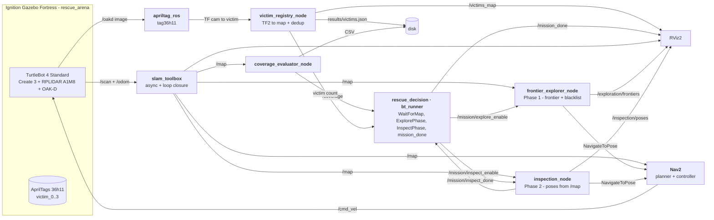

# Autonomous Search and Rescue: IA712 (Project B)

> Autonomous mobile robot that explores an unknown simulated disaster area in Ignition Gazebo (TurtleBot 4), maps it by SLAM, and localizes "victims" (AprilTags), **without human intervention**.

[](https://docs.ros.org/en/humble/)
[](https://releases.ubuntu.com/22.04/)
[](LICENSE)

## Contents

- [Overview](#overview)
- [Quick start](#quick-start)
- [Architecture](#architecture)
- [Main packages](#main-packages)
- [Results](#results)
- [Known limitations](#known-limitations)
- [References](#references)
- [License](#license)

## Overview

A single TurtleBot 4 runs a fully autonomous **two-phase mission**, orchestrated by a Behavior Tree:

1. **Exploration**: frontier-based exploration with information-gain selection builds the map by SLAM until coverage reaches 90 %.
2. **Inspection**: the robot derives one pose per discovered room from the SLAM map and visits each one to bring the camera within range of every wall-mounted AprilTag.

The Behavior Tree (`rescue_decision`, BehaviorTree.CPP) decides *when* each phase starts and stops via `/mission/*` topics; the Python nodes do the work. One continuous run, from a single command, reaches **97.35 % coverage and 4/4 victims**.

**Team RobotZ**, ENSTA / Télécom Paris (IA712)

| Name | Email |
| --- | --- |
| Julien GIMENEZ | `julien.gimenez@telecom-paris.fr` |
| Hugo FANCHINI | `hugo.fanchini@telecom-paris.fr` |
| Paul CINTRA | `paul.cintra@telecom-paris.fr` |
| Yimou ZHANG | `yimou.zhang@telecom-paris.fr` |

## Quick start

```bash
# 1. Install dependencies (ROS 2 Humble + TurtleBot 4 + Nav2 + slam_toolbox + apriltag_ros)
./scripts/run.sh install-apt

# 2. Build the workspace
cd ros2_ws && colcon build --symlink-install && source install/setup.bash

# 3. Run the full autonomous mission (one click)
./scripts/run.sh demo-tb4
```

Notes: deactivate Conda (`conda deactivate`) before `colcon build`; on WSL 2 the package
`ros-humble-rmw-cyclonedds-cpp` is required (Fast-RTPS discovery is unreliable there).

Bonus: greedy vs information-gain exploration benchmark:

```bash
bash scripts/sh/run_benchmark.sh
python3 scripts/plot_benchmark.py experiments   # -> experiments/plots/coverage_over_time.png
```

## Architecture

The workspace is split into **four ROS 2 packages**: `rescue_bringup` (launch + configs),
`rescue_robot` (Python nodes: exploration, perception, results), `rescue_world` (Ignition
worlds + AprilTag targets) and `rescue_decision` (the C++ Behavior Tree).



## Main packages

- **`rescue_bringup`**: one-click launch (`bringup_tb4.launch.py`) and the Nav2 / SLAM / AprilTag configurations.
- **`rescue_robot`**: the Python nodes: `frontier_explorer_node` (Phase 1, frontier search + inaccessible-frontier blacklist), `inspection_node` (Phase 2, poses derived from the SLAM map), `victim_registry_node` (projects camera detections to the `map` frame with TF2 and de-duplicates), `coverage_evaluator_node`, `rviz_marker_node`, result export and dev mocks.
- **`rescue_world`**: the Ignition Fortress arena (`rescue_arena.sdf`) and the voxel AprilTag victims.
- **`rescue_decision`**: the C++ BehaviorTree.CPP runner (`bt_xml/mission.xml`), visualisable in Groot.

## Results

One continuous, fully autonomous run: **97.35 % coverage and 4/4 victims**, one click, with no prior knowledge of the rooms or the victims' locations.

▶ **Demo video:** [youtube.com/watch?v=BKXprWFloFs](https://www.youtube.com/watch?v=BKXprWFloFs)

| Frontier exploration in RViz | Gazebo arena (AprilTags visible) |
|:--:|:--:|
|  |  |
| **Final map: 4 victims + inspection tour** | **Coverage & path vs. time (90 % target)** |
|  |  |


In RViz, the frontier cells are coloured per cluster (connected component), the yellow sphere is the
best-utility goal frontier and the blue line is the Nav2 plan. Two screen recordings are produced each
run: `results/gazebo_capture.mp4` (the simulated arena) and `results/rviz_capture.mp4` (the SLAM map +
frontiers + inspection). More figures are in [`docs/report/figures/`](docs/report/figures/).

Deliverables in [`docs/soutenance/`](docs/soutenance/):

- Report: [EN](docs/soutenance/rapport10p_EN.pdf) · [FR](docs/soutenance/rapport10p_FR.pdf)
- Slides: [EN](docs/soutenance/presentation10m.pdf) · [FR](docs/soutenance/presentation10m_FR.pdf)
- Publication: [EN](docs/soutenance/publication_EN.pdf) · [FR](docs/soutenance/publication_FR.pdf)

## Known limitations

- The mission is tuned for the `rescue_arena` world; other Ignition worlds (maze, depot) explore but may not reach 90 % within the default time budget.
- AprilTag detection range is about 2 m for the 16 cm tags; the inspection phase exists precisely to bring the camera within that range.
- The optional RViz screen-recording uses software-GL rendering and adds CPU load; disable it with `IA712_RVIZ_RECORD=0` on constrained hosts.

## References

- [`apriltag_ros`](https://github.com/christianrauch/apriltag_ros): AprilTag detector for ROS 2
- [`slam_toolbox`](https://github.com/SteveMacenski/slam_toolbox): 2D SLAM with loop closure
- [Nav2](https://docs.nav2.org/): navigation stack
- [BehaviorTree.CPP](https://www.behaviortree.dev/): Behavior Tree engine (with the Groot monitor)
- Yamauchi, B. (1997). *A frontier-based approach for autonomous exploration*. CIRA.
- Stachniss, C., Grisetti, G., Burgard, W. (2005). *Information Gain-based Exploration Using Rao-Blackwellized Particle Filters*. RSS.

## License

MIT. See [LICENSE](LICENSE).
