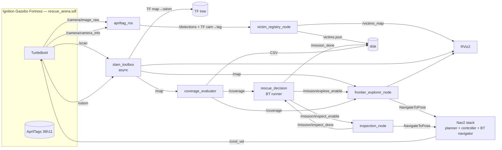

# Architecture système — Projet B (IA712 Search & Rescue)

> Vue système du pipeline complet **SLAM → Exploration → Perception → Décision** orchestré par un Behavior Tree, conformément aux exigences du sujet B et au CM8 (« Exploration »).

## 1. Vue d'ensemble



## 2. Flux clés

1. **SLAM en continu** publie `/map` (OccupancyGrid) et la TF `map → odom`.
2. **Phase 1 — Exploration.** Le BT lève `/mission/explore_enable` ; `frontier_explorer_node` lit `/map`, détecte les frontières (avec *blacklist* des frontières inatteignables), choisit la meilleure et l'envoie à Nav2 via `nav2_msgs/action/NavigateToPose`. La phase tourne (`RUNNING`) jusqu'à `/coverage ≥ 0.90`.
3. **Phase 2 — Inspection.** Le BT lève `/mission/inspect_enable` ; `inspection_node` dérive de `/map` une pose par pièce (sans aucune coordonnée de victime) et les visite l'une après l'autre pour exposer les AprilTags muraux à la caméra, puis verrouille `/mission/inspect_done` (`RUNNING` jusqu'à ce flag).
4. **La caméra** alimente `apriltag_ros` qui publie une TF `camera_link → tag_<id>` + un message `/detections`.
5. **`victim_registry_node`** compose la chaîne `map → camera_link → tag_<id>` via `tf2_ros::Buffer::lookupTransform()` et enregistre chaque victime (si nouvelle) avec sa pose dans `map`, publiée sur `/victims_map` et persistée dans `results/victims.json`.
6. **Le BT global** orchestre les deux phases dans l'ordre, surface le compte de victimes (`VictimsFound`), puis verrouille `/mission_done`.
7. **Critère de fin :** couverture ≥ 90 % atteinte (fin Phase 1) **puis** toutes les pièces inspectées (`/mission/inspect_done`). Run nominal : 4/4 victimes, ~97 % de couverture.

## 3. Behavior Tree global (2 phases)

Le BT (BehaviorTree.CPP **v3**, runner `src/bt_runner.cpp`, arbre `bt_xml/mission.xml`) **orchestre** la mission en deux phases — pas de FSM. Une simple `Sequence` *à mémoire* (elle reprend sur l'enfant `RUNNING` et n'avance qu'au `SUCCESS`) enchaîne les phases dans l'ordre.

```xml
<root main_tree_to_execute="Mission">
  <BehaviorTree ID="Mission">
    <Sequence name="search_and_rescue_mission">
      <WaitForMap name="wait_for_slam_map"/>
      <ExplorePhase name="explore_until_coverage" threshold="0.90"/>
      <InspectPhase name="inspect_discovered_rooms"/>
      <VictimsFound name="report_victims" min_count="0"/>
      <PublishMissionDone name="finalize"/>
    </Sequence>
  </BehaviorTree>
</root>
```

Nodes BT custom (paquet `rescue_decision`) :

- `WaitForMap` *(Condition)* — `FAILURE` tant que SLAM ne publie pas `/map` (la séquence retente au tick suivant).
- `ExplorePhase` *(Action)* — lève `/mission/explore_enable` (déclenche `frontier_explorer_node`) ; `RUNNING` jusqu'à `/coverage ≥ threshold` (0.90), puis baisse le flag (stoppe l'explorateur) et renvoie `SUCCESS`.
- `InspectPhase` *(Action)* — lève `/mission/inspect_enable` (déclenche `inspection_node`) ; `RUNNING` jusqu'à réception de `/mission/inspect_done`.
- `VictimsFound` *(Condition)* — `SUCCESS` quand `/victims_map` contient ≥ `min_count` poses (ici 0 → ne bloque jamais, sert au log du compte).
- `PublishMissionDone` *(Action)* — verrouille `std_msgs/Bool true` sur `/mission_done`.

Après le `SUCCESS` de la `Sequence`, le runner reste actif pour garder `/mission_done` verrouillé (et Groot connecté).

## 4. TF tree cible

```
map ──> odom ──> base_footprint ──> base_link ──┬──> base_scan
                                                └──> camera_link ──> camera_rgb_optical_frame
                                                                       └──> tag_<id>  (publié par apriltag_ros)
```

- `map → odom` publié par **`slam_toolbox`**.
- `odom → base_footprint` publié par `robot_state_publisher` (Gazebo plugin).
- `base_link → camera_link` issu de l'URDF TurtleBot4.
- `camera_link → tag_<id>` publié par **`apriltag_ros`**.

## 5. Topics & services principaux

| Topic / Service                      | Type                                         | Producteur          | Consommateur         |
| ------------------------------------ | -------------------------------------------- | ------------------- | -------------------- |
| `/scan`                              | `sensor_msgs/LaserScan`                      | Gazebo plugin       | `slam_toolbox`       |
| `/odom`                              | `nav_msgs/Odometry`                          | Gazebo plugin       | `slam_toolbox`, Nav2 |
| `/camera/image_raw`                  | `sensor_msgs/Image`                          | Gazebo plugin       | `apriltag_ros`       |
| `/camera/camera_info`                | `sensor_msgs/CameraInfo`                     | Gazebo plugin       | `apriltag_ros`       |
| `/map`                               | `nav_msgs/OccupancyGrid`                     | `slam_toolbox`      | `frontier_explorer`, `inspection_node`, `coverage_evaluator`, Nav2 |
| `/detections`                        | `apriltag_msgs/AprilTagDetectionArray`       | `apriltag_ros`      | `victim_registry`    |
| `/coverage`                          | `std_msgs/Float32`                           | `coverage_evaluator`| BT (`ExplorePhase`), `frontier_explorer` |
| `/victims_map`                       | `geometry_msgs/PoseArray`                    | `victim_registry`   | BT (`VictimsFound`), `result_exporter`, RViz |
| `/mission/explore_enable`            | `std_msgs/Bool`                              | BT (`ExplorePhase`) | `frontier_explorer`  |
| `/mission/inspect_enable`            | `std_msgs/Bool`                              | BT (`InspectPhase`) | `inspection_node`    |
| `/mission/inspect_done`              | `std_msgs/Bool` (latched)                    | `inspection_node`   | BT (`InspectPhase`)  |
| `/mission_done`                      | `std_msgs/Bool` (latched)                    | BT (`PublishMissionDone`) | démo / supervision |
| `/exploration/frontiers`             | `visualization_msgs/MarkerArray`             | `frontier_explorer` | RViz                 |
| `/inspection/poses`                  | `visualization_msgs/MarkerArray`             | `inspection_node`   | RViz                 |
| `navigate_to_pose` (action)          | `nav2_msgs/action/NavigateToPose`            | Nav2                | `frontier_explorer`, `inspection_node` |

## 6. Choix techniques (cf. [pistes_projet-b.md §2](../../doc/orig/pistes_projet-b.md))

| Brique                | Choix                                              | Justification (cours / projet)                                                  |
| --------------------- | -------------------------------------------------- | ------------------------------------------------------------------------------- |
| Distribution ROS 2    | **Humble** (LTS)                                   | Confirmée `rosversion -d` ; stack Nav2/slam_toolbox mature                      |
| OS                    | Ubuntu 22.04 jammy (WSL2)              | Compatible ROS 2 Humble                                                         |
| Simulateur            | **Ignition Gazebo Fortress**                       | Stack TurtleBot4 native ; monde `rescue_arena.sdf` (plugins `ignition-gazebo-*`) |
| Robot                 | **TurtleBot4**                                     | LIDAR 2D **+ caméra RGB** (requise pour AprilTag)                               |
| SLAM                  | **`slam_toolbox`** mode `async`                    | Loop closure natif (CM7), intégration Nav2                                      |
| Navigation            | **Nav2** complet                                   | Planner + controller + recoveries + BT navigator                                |
| Décision              | **BehaviorTree.CPP v3** (runner `rescue_decision`) | Arbre 2 phases (`mission.xml`), Groot pour debug ; **interdiction des FSM**     |
| Détection cibles      | **`apriltag_ros`** (tag36h11)                      | Robuste, IDs uniques, publie TF out-of-the-box (cf. CM6 « Perception »)         |
| Exploration v1        | **Frontière gloutonne** (`m-explore-ros2` ou maison) | Baseline attendue par l'énoncé (cf. CM8)                                      |
| Exploration v2 (bonus)| **Information-Gain** maison                        | Comparatif quantitatif (cf. CM8 § Information-Theoretic Exploration)            |

## 7. Risques système (cf. [pistes_projet-b.md §9](../../doc/orig/pistes_projet-b.md))

| Risque                                            | Mitigation                                                          |
| ------------------------------------------------- | ------------------------------------------------------------------- |
| `m-explore-ros2` cassé sur Humble                 | Plan B : réimplémentation Python ~300 lignes                        |
| Loop closure mal tunée, carte qui dérive          | Tuning précoce L15 + backup avec map pré-générée                    |
| AprilTag mal détecté (éclairage Gazebo)           | Fallback cylindres colorés HSV via OpenCV                           |
| BT trop complexe, debug long                      | Arbre minimal d'abord, Groot2 pour visualiser, tests isolés         |
| WSL2 + Gazebo GUI instable                        | Mode `headless:=true` validé tôt + vidéo backup pour la démo finale |

## 8. Liens vers les paquets

- [`ros2_ws/src/rescue_bringup/`](../ros2_ws/src/rescue_bringup/) — Launch & configs
- [`ros2_ws/src/rescue_world/`](../ros2_ws/src/rescue_world/) — Mondes Ignition (`rescue_arena.sdf`) + AprilTags
- [`ros2_ws/src/rescue_robot/`](../ros2_ws/src/rescue_robot/) — Mégapaquet Python : exploration, perception (victim registry), navigation/inspection, résultats/métriques, utils, mocks
- [`ros2_ws/src/rescue_decision/`](../ros2_ws/src/rescue_decision/) — BT runner (`src/bt_runner.cpp`) & arbre (`bt_xml/mission.xml`) en BehaviorTree.CPP v3

## 9. Lancement un-clic

```bash
ros2 launch rescue_bringup bringup_tb4.launch.py
```

Démarre la stack complète (Ignition Gazebo Fortress + TurtleBot4 + SLAM + Nav2 + apriltag_ros + nœuds `rescue_robot` + BT `rescue_decision`). Run nominal : **4/4 victimes**, **~97 % de couverture**.
