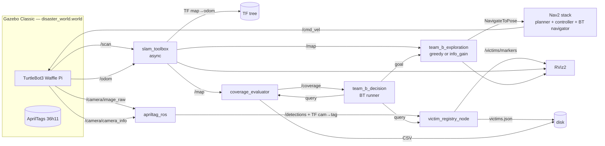

# Architecture système — Projet B (IA712 Search & Rescue)

> Vue système du pipeline complet **SLAM → Exploration → Perception → Décision** orchestré par un Behavior Tree, conformément aux exigences du sujet B et au CM8 (« Exploration »).

## 1. Vue d'ensemble



## 2. Flux clés

1. **SLAM en continu** publie `/map` (OccupancyGrid) et la TF `map → odom`.
2. **L'explorateur** (frontière gloutonne ou information-gain) lit `/map`, choisit un goal, l'envoie à Nav2 via `nav2_msgs/action/NavigateToPose`.
3. **La caméra** alimente `apriltag_ros` qui publie une TF `camera_link → tag_<id>` + un message `/detections`.
4. **`victim_registry_node`** compose la chaîne `map → camera_link → tag_<id>` via `tf2_ros::Buffer::lookupTransform()` et enregistre la victime (si nouvelle) avec sa pose dans `map`.
5. **Le BT global** synchronise tout : pause de l'exploration au moment d'une détection, log, reprise.
6. **Critère d'arrêt :** couverture ≥ 90 % **OU** absence de nouvelle frontière **OU** toutes les victimes attendues trouvées.

## 3. Behavior Tree global

```xml
<root BTCPP_format="4">
  <BehaviorTree ID="ExplorationMission">
    <Sequence>
      <SetBlackboard output_key="victims_found" value="0"/>
      <ReactiveFallback>
        <CoverageReached threshold="0.9"/>
        <Sequence>
          <RetryUntilSuccessful num_attempts="3">
            <Sequence>
              <SelectNextFrontier output_pose="{goal}"/>
              <NavigateToPose goal="{goal}"/>
            </Sequence>
          </RetryUntilSuccessful>
          <ReactiveSequence>
            <IsVictimDetected target="{victim_pose}"/>
            <RegisterVictim pose="{victim_pose}"/>
            <Wait duration="1.0"/>
          </ReactiveSequence>
        </Sequence>
      </ReactiveFallback>
      <NavigateToPose goal="{home_pose}"/>
    </Sequence>
  </BehaviorTree>
</root>
```

Nodes BT custom (paquet `team_b_decision`) :

- `SelectNextFrontier` *(Action)* — interroge le node d'exploration.
- `CoverageReached` *(Condition)* — lit `/coverage` publié par `coverage_evaluator`.
- `IsVictimDetected` *(Condition)* — interroge le registre de victimes.
- `RegisterVictim` *(Action)* — appelle le service du registre.

## 4. TF tree cible

```
map ──> odom ──> base_footprint ──> base_link ──┬──> base_scan
                                                └──> camera_link ──> camera_rgb_optical_frame
                                                                       └──> tag_<id>  (publié par apriltag_ros)
```

- `map → odom` publié par **`slam_toolbox`**.
- `odom → base_footprint` publié par `robot_state_publisher` (Gazebo plugin).
- `base_link → camera_link` issu de l'URDF TurtleBot3 Waffle Pi.
- `camera_link → tag_<id>` publié par **`apriltag_ros`**.

## 5. Topics & services principaux

| Topic / Service                      | Type                                         | Producteur          | Consommateur         |
| ------------------------------------ | -------------------------------------------- | ------------------- | -------------------- |
| `/scan`                              | `sensor_msgs/LaserScan`                      | Gazebo plugin       | `slam_toolbox`       |
| `/odom`                              | `nav_msgs/Odometry`                          | Gazebo plugin       | `slam_toolbox`, Nav2 |
| `/camera/image_raw`                  | `sensor_msgs/Image`                          | Gazebo plugin       | `apriltag_ros`       |
| `/camera/camera_info`                | `sensor_msgs/CameraInfo`                     | Gazebo plugin       | `apriltag_ros`       |
| `/map`                               | `nav_msgs/OccupancyGrid`                     | `slam_toolbox`      | `team_b_exploration`, `coverage_evaluator`, Nav2 |
| `/detections`                        | `apriltag_msgs/AprilTagDetectionArray`       | `apriltag_ros`      | `victim_registry`    |
| `/coverage`                          | `std_msgs/Float32`                           | `coverage_evaluator`| BT (`CoverageReached`) |
| `/victims/markers`                   | `visualization_msgs/MarkerArray`             | `victim_registry`   | RViz                 |
| `/list_victims` (service)            | custom                                       | `victim_registry`   | démo / BT            |
| `navigate_to_pose` (action)          | `nav2_msgs/action/NavigateToPose`            | Nav2                | BT / explorateur     |

## 6. Choix techniques (cf. [pistes_projet-b.md §2](../../doc/orig/pistes_projet-b.md))

| Brique                | Choix                                              | Justification (cours / projet)                                                  |
| --------------------- | -------------------------------------------------- | ------------------------------------------------------------------------------- |
| Distribution ROS 2    | **Humble** (LTS)                                   | Confirmée `rosversion -d` ; stack Nav2/slam_toolbox mature                      |
| OS                    | Ubuntu 22.04 jammy (WSL2 chez Julien)              | Compatible ROS 2 Humble                                                         |
| Simulateur            | **Gazebo Classic 11**                              | Plus stable que Fortress sur WSL ; doc Nav2/TurtleBot3 alignée                  |
| Robot                 | **TurtleBot3 Waffle Pi**                           | LIDAR 2D **+ caméra RGB** (requise pour AprilTag)                               |
| SLAM                  | **`slam_toolbox`** mode `async`                    | Loop closure natif (CM7), intégration Nav2                                      |
| Navigation            | **Nav2** complet                                   | Planner + controller + recoveries + BT navigator                                |
| Décision              | **BehaviorTree.CPP** via `nav2_behavior_tree`      | Réutilise l'infra BT existante ; Groot2 pour debug ; **interdiction des FSM**   |
| Détection cibles      | **`apriltag_ros`** (tag36h11)                      | Robuste, IDs uniques, publie TF out-of-the-box (cf. CM6 « Perception »)         |
| Exploration v1        | **Frontière gloutonne** (`m-explore-ros2` ou maison) | Baseline attendue par l'énoncé (cf. CM8)                                      |
| Exploration v2 (bonus)| **Information-Gain** maison                        | Comparatif quantitatif (cf. CM8 § Information-Theoretic Exploration)            |

## 7. Risques système (cf. [pistes_projet-b.md §9](../../doc/orig/pistes_projet-b.md))

| Risque                                            | Mitigation                                                          |
| ------------------------------------------------- | ------------------------------------------------------------------- |
| `m-explore-ros2` cassé sur Humble                 | Plan B : réimplémentation Python ~300 lignes                        |
| Loop closure mal tunée, carte qui dérive          | Tuning précoce L15 + backup avec map pré-générée                    |
| AprilTag mal détecté (éclairage Gazebo)           | Fallback cylindres colorés HSV via OpenCV                           |
| BT trop complexe, debug long                      | Arbre minimal d'abord, Groot2 pour visualiser, tests isolés         |
| WSL2 + Gazebo GUI instable                        | Mode `headless:=true` validé tôt + vidéo backup pour la démo finale |

## 8. Liens vers les paquets

- [`ros2_ws/src/team_b_bringup/`](../ros2_ws/src/team_b_bringup/) — Launch & configs
- [`ros2_ws/src/team_b_world/`](../ros2_ws/src/team_b_world/) — Monde Gazebo + AprilTags
- [`ros2_ws/src/team_b_exploration/`](../ros2_ws/src/team_b_exploration/) — Exploration nodes
- [`ros2_ws/src/team_b_perception/`](../ros2_ws/src/team_b_perception/) — Victim registry
- [`ros2_ws/src/team_b_decision/`](../ros2_ws/src/team_b_decision/) — BT runner & BT nodes
- [`ros2_ws/src/team_b_metrics/`](../ros2_ws/src/team_b_metrics/) — Coverage & benchmarks
