# IA712 Search and Rescue — Architecture Diagrams

Ce document regroupe les principaux diagrammes d'architecture du projet **IA712 Mobile Robotics — Search and Rescue**.

Objectif du projet : faire évoluer un robot mobile autonome dans un environnement simulé Gazebo, construire une carte, explorer une zone inconnue, détecter des victimes avec caméra, projeter leurs positions dans le repère `map`, puis produire une carte annotée et des résultats exploitables.

---

## 1. Arborescence globale du projet

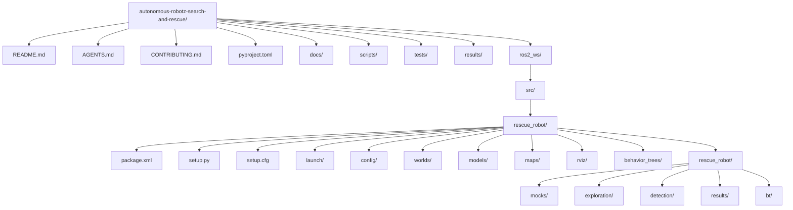

---

## 2. Convention ROS 2 / Python du double dossier

Le chemin suivant est normal :

```text
ros2_ws/src/rescue_robot/rescue_robot/
```

Le premier `rescue_robot` est le **package ROS 2**.  
Le second `rescue_robot` est le **module Python importable**.

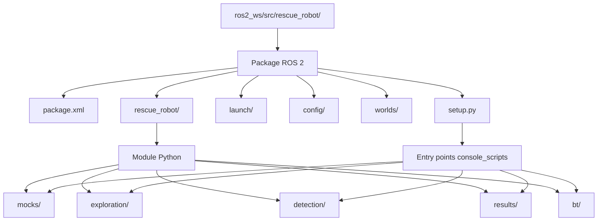

Ne pas renommer ni supprimer le deuxième dossier `rescue_robot/`, sinon les entry points définis dans `setup.py` ne fonctionneront plus.

---

## 3. Architecture fonctionnelle globale

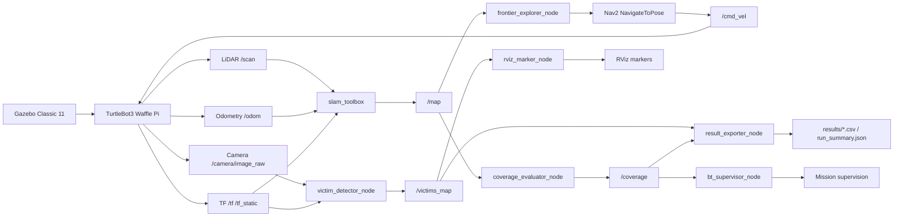

---

## 4. Architecture ROS 2 — simulation réelle Waffle Pi

Ce diagramme représente l'état actuel validé avec Gazebo, TurtleBot3 Waffle Pi, caméra, LiDAR, odométrie et téléopération.

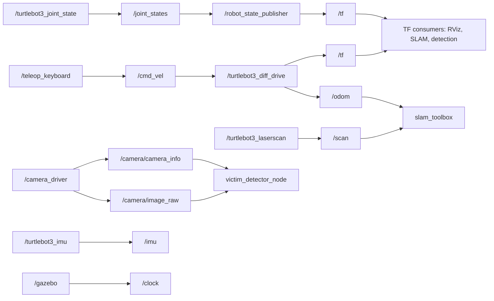

---

## 5. Topics principaux validés

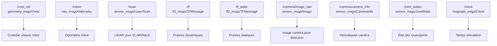

---

## 6. Pipeline SLAM

Objectif : transformer les mesures LiDAR + odométrie + TF en carte `/map`.

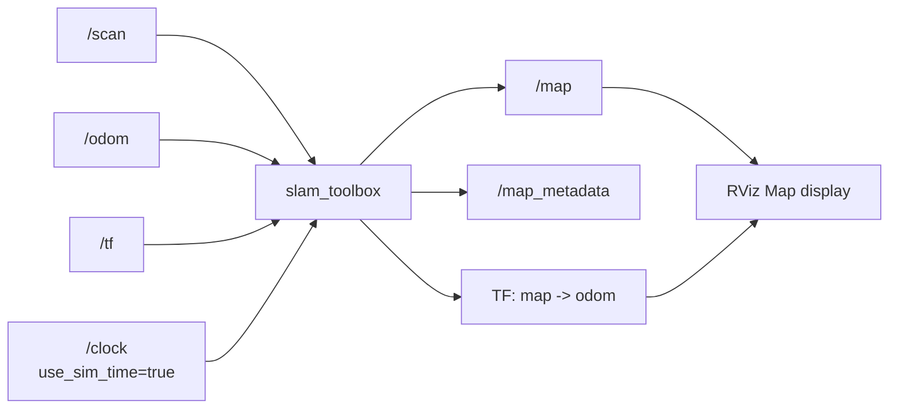

Pour visualiser la carte dans RViz :

```text
Fixed Frame = map
Add -> Map -> /map
Add -> LaserScan -> /scan
Add -> TF
Add -> RobotModel
```

---

## 7. Pipeline Nav2

Objectif : recevoir une carte, localiser le robot et envoyer des commandes vers `/cmd_vel`.

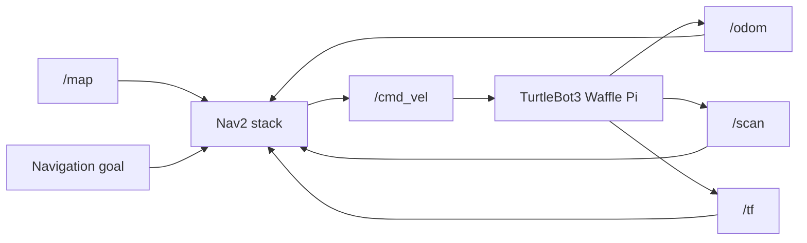

Nav2 deviendra nécessaire quand l'exploration autonome enverra des objectifs vers des frontières.

---

## 8. Pipeline exploration autonome

Objectif : choisir automatiquement les prochaines zones inconnues à explorer.

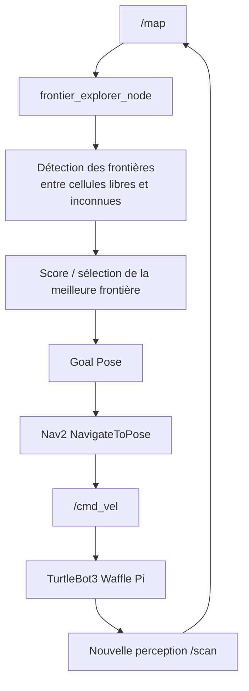

Critère de fin possible :

```text
coverage >= 0.90
```

---

## 9. Pipeline détection des victimes

Objectif : détecter des victimes dans l'image caméra, puis projeter leur position dans le repère `map`.

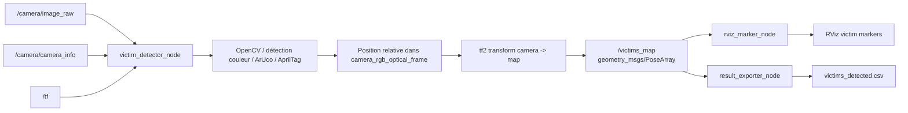

---

## 10. Arbre TF attendu

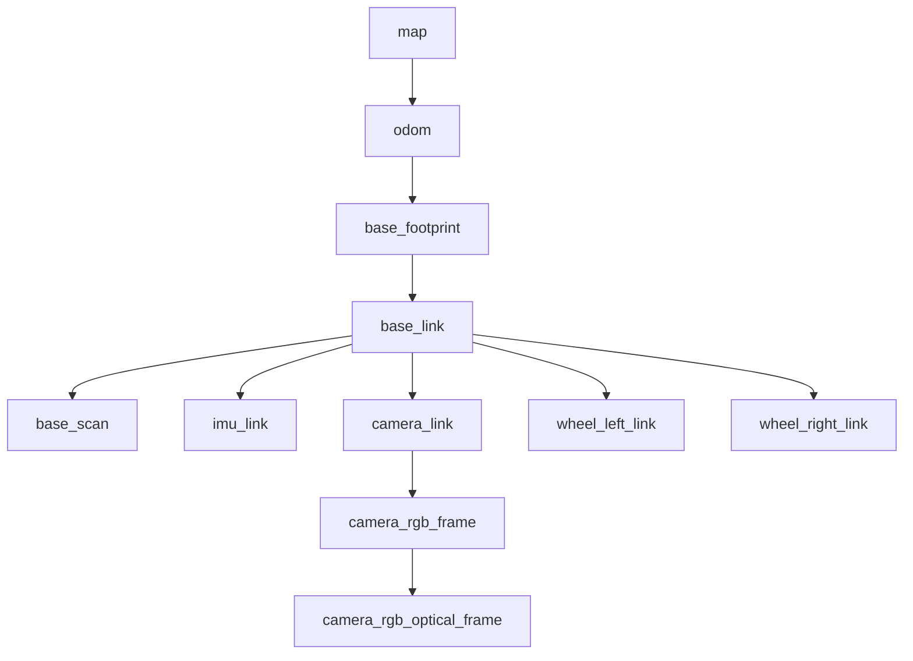

Pour vérifier :

```bash
ros2 run tf2_tools view_frames
xdg-open frames.pdf
```

Pendant la simulation sans SLAM, `map` peut être absent. Avec `slam_toolbox`, on attend :

```text
map -> odom
```

---

## 11. Mock system

Le mock system permet de tester les modules sans Gazebo/Nav2/SLAM.

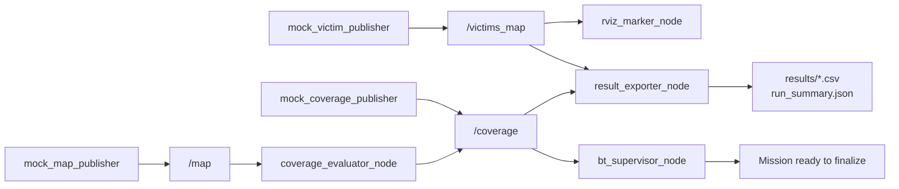

Commande :

```bash
./scripts/run.sh mock
```

---

## 12. Différence entre mock et simulation réelle

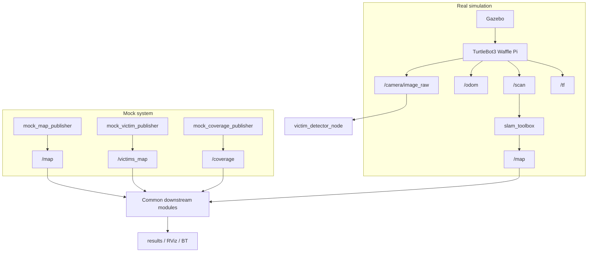

---

## 13. Launch files

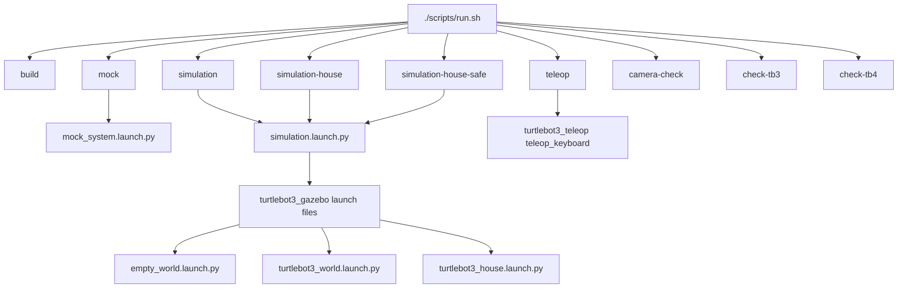

---

## 14. Scripts et rôle des wrappers shell

Les scripts `.sh` simplifient l'usage, mais les vrais points d'entrée ROS restent les launch files.

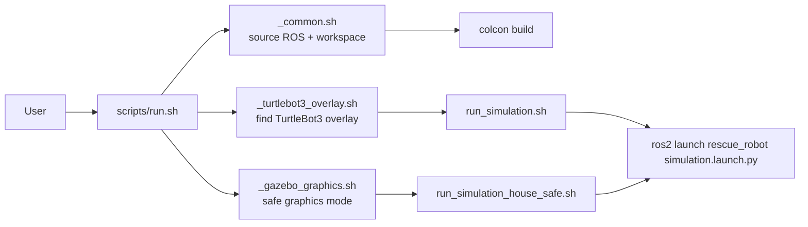

---

## 15. Architecture de développement par rôles

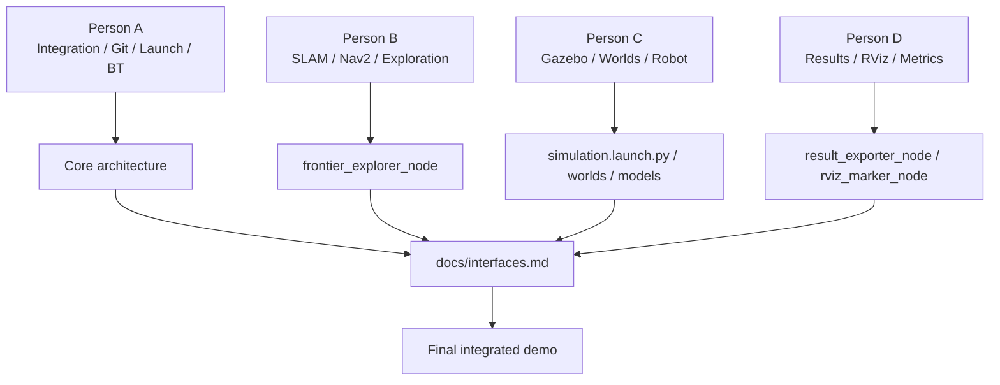

---

## 16. Architecture cible finale

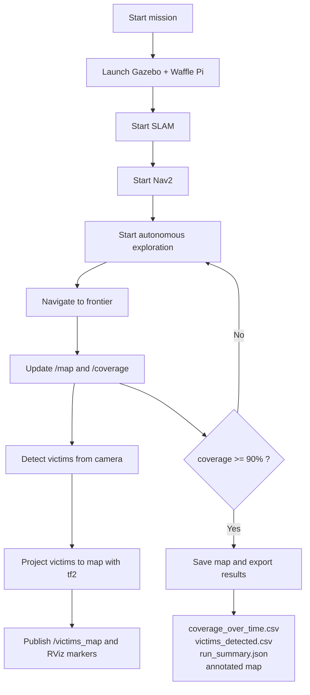

---

## 17. Commandes utiles pour générer les graphes réels

### Graphe nodes/topics

```bash
rqt_graph
```

Mode safe graphics si nécessaire :

```bash
QT_QPA_PLATFORM=xcb \
GDK_BACKEND=x11 \
LIBGL_ALWAYS_SOFTWARE=1 \
MESA_GL_VERSION_OVERRIDE=3.3 \
MESA_GLSL_VERSION_OVERRIDE=330 \
rqt_graph
```

### Graphe TF

```bash
ros2 run tf2_tools view_frames
xdg-open frames.pdf
```

### Liste nodes

```bash
ros2 node list
```

### Liste topics avec types

```bash
ros2 topic list -t
```

### Informations sur topics importants

```bash
ros2 topic info /cmd_vel
ros2 topic info /scan
ros2 topic info /odom
ros2 topic info /camera/image_raw
ros2 topic info /camera/camera_info
ros2 topic info /tf
```
